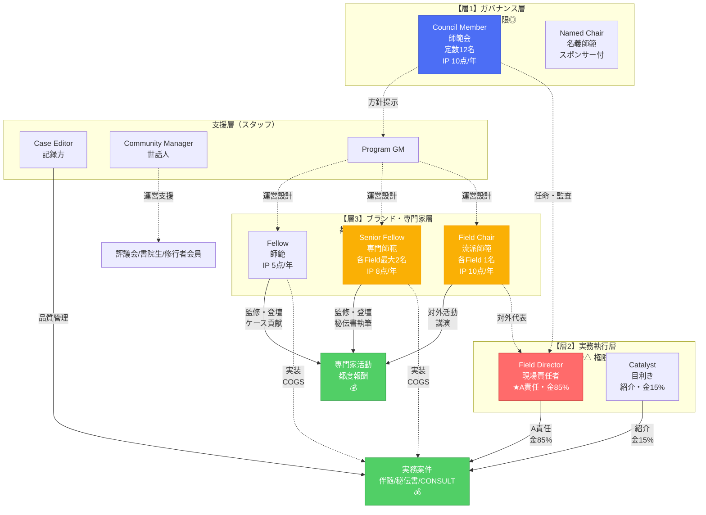
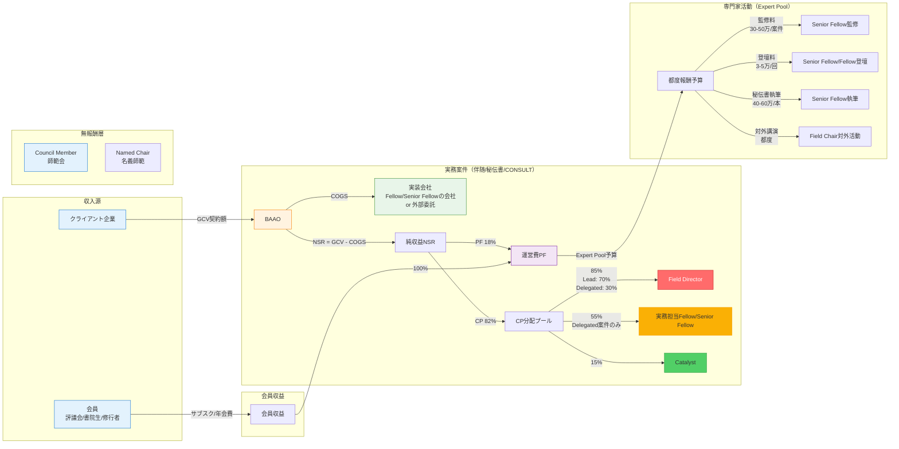

# BAAO Operations Handbook｜運用ハンドブック

> 一行要約：本書は「BAAO 実戦AI道場｜BAAO Dojo for Practical AI」の内部標準。金の流れ・肩書き運用・契約・公開・ガバナンス、**実装知（秘伝書）による品質担保**、そして**心理トリガー（S.P.A.R.K.）による行動設計**を単一の真実として定義する。

**BAAOの本質**：実装知のプラットフォーム。成功ユースケースと秘伝書を蓄積し、インフルエンサー専門家の影響力を集団で増幅する。

**対象**：理事／Program GM／Field Directors／Senior Fellows／Fellows／Case Editor／Community Manager／Catalysts／事務局

**何が手に入る**：配点と分配の式、役割とSLA、任命と更新、契約ひな形、公開とクレジットの手順、**心理トリガー別の仕掛け一覧と運用ルール**

**責任者**：Program GM（設計・版管理）／Case Editor（検証性・公開整合）／CM（演出・台本・コミュ運用）

**更新**：2025/09/27

**秘匿区分**：**内部限定（外部共有禁止）**

---

## 目次

0. [心理トリガーと行動科学（S.P.A.R.K.）](#0-心理トリガーと行動科学spark)
1. [組織と肩書きの標準](#1-組織と肩書きの標準)
2. [実装知プラットフォームモデル](#2-実装知プラットフォームモデル)
3. [秘伝書 & 品質担保](#3-recipes--品質担保)
4. [Money Flows](#4-money-flows)
5. [契約・法務](#5-契約法務)
6. [Publishing & Credit](#6-publishing--credit)
7. [Appointments & Impact Points](#7-appointments--impact-points)
8. [運用SLA](#8-運用sla)
9. [KPIフレーム](#9-kpiフレーム)
10. [セキュリティ・権限・記録](#10-セキュリティ権限記録)
11. [テンプレ集](#11-テンプレ集)
12. [監査・違反時対応・改定](#12-監査違反時対応改定)

---

## 0) 心理トリガーと行動科学（S.P.A.R.K.）

### 0-1. 設計思想（なぜ心理を織り込むか）

- **目的**：人の「権限欲・公正感・承認欲・希少性嗜好」を**構造側で味方に付ける**。
- **方針**：**最小の実質＋最大の可視化**。虚飾は禁止、**検証可能性**で演出を正当化する。
- **原則（S.P.A.R.K.）**：**S**carcity（希少）／**P**roof（検証）／**A**ccess（特権）／**R**itual（儀式）／**K**arma（貢献評価）。

---

### 0-2. トリガー早見（心理×仕掛け×効果×安全策）

| 心理トリガー | 仕掛け（BAAO機能） | ねらい | 安全策 |
|------------|------------------|--------|--------|
| **希少性** | 定数：Council=12、Field Director各Field1、Senior Fellow各Field最大2 | 役職を「欲しい状態」に | 定数を公開、年次見直しのみ増減 |
| **検証可能性** | Appointment#／検証QR／Yearbook | 信頼・自慢の両立 | 失効時に自動でExpired表示 |
| **公正感（分配）** | PF18%・配点 Field60/Practice25/Catalyst15（公共50/30/20） | もめない・速い支払 | 例外裁量禁止、変更は理事会のみ |
| **責任の一元化** | A=Field Director／24h担当宣言 | すり抜け・二重見積防止 | CRM未宣言はCatalyst暫定保持 |
| **目標勾配** | Impact Points（Fellow≥5/Senior≥8） | 更新へ向けた行動 | 指標の可視化、季末の追い込みOK |
| **損失回避** | 任期更新と席次、特権（先行閲覧/Green Room/帯同権） | 「落ちたくない」動機 | 未達でもAlumni称号で軟着地 |
| **社会的証明** | Byline固定／連名声明／ケースP優先表示 | 公開での権威化 | C/Rはラベル明示で誤認防止 |
| **即時報酬** | 就任儀式60秒／黒バッジ／席次 | 着任直後の満足 | 儀式は短く、乱発しない |
| **既得効果** | Named Chair・任命状・通し番号 | 所有感で離脱抑止 | COI明示、編集不干渉条項 |
| **早耳特典** | Embargoed First Look 72h | 先行参加の価値 | フィードバック窓口を同梱 |

---

### 0-3. 反カニバリの心理学（Field/Practice/Mission＋RACI）

**設計**

- **一次責任の原則**：Aは常にField Director。
  心理効果＝**責任の拡散（傍観者効果）**を遮断。

- **24h担当宣言**：新規リードは24時間以内に担当Fieldを宣言。
  心理効果＝**即時性の規範**と**先着優位（エンタイトルメント）**を付与。

- **三層タグ固定**：`Field × Mission × Practice` で曖昧さを消す。
  心理効果＝**不確実性回避**＋**選択アーキテクチャ**で迷いを削る。

**運用コピー（CRMトースト）**

- 「担当Fieldが未宣言です（24hルール）。**今すぐ宣言**で席を確定しましょう。」
- 「この案件のAは**現場責任者**です。ダブル見積は禁止。PracticeはR/Sで出向。」

---

### 0-4. お金の流れの心理学（PF/配点/会計と公正）

**定義と式（再掲）**

```
NSR = GCV − COGS
PF  = NSR × 0.18
CP  = NSR − PF
分配 = CP × { Field 0.85 / Catalyst 0.15 }
（COGSは実装外注費として別途支払い）
```

**心理実装**

- **単純ルール**：誰でも暗算できる比率。**認知負荷を最小化**し、疑心を減らす。
- **見える化**：案件詳細に**自動計算フィールド**を表示。**公正感（プロシージャル・ジャスティス）**を担保。
- **先に決める**：SOWに支払スケジュール（40/40/20）とPF率明記。**契約前に摩擦を解消**。
- **鞍替え（共ブランド）**：PC（12%）または**公開1本＋レシピ1本で5%**へ減免。
  心理効果＝努力正当化と**名誉（公開）**の交換でPCの痛みを中和。

**会計の二本立て**

- **Recognized**（A/B）と**Influenced**（C/D）を**別枠**で開示。
  心理効果＝**透明性**と**帰属先の納得**。Yearbookでは格付（P/C/R）を明示し、**誤認の誘惑**を減らす。

---

### 0-5. 実績付けの心理学（P/C/R・Impact Points・Yearbook）

**P/C/Rの意味付け**

- **P（Prime）**：BAAO受託の正規。
- **C（Co‑Branded）**：個人/会員主契約だが**方法・公開・拠出**でBAAO実績に格上げ。
- **R（Referred）**：紹介。12か月の**紹介権**。

**心理効果**

- ラベル付けにより**所属アイデンティティ**を付与。
- C/Rにも**正当な居場所**を作ることで**フリーライド→参加**へ誘導。

**Impact Points（更新の動機）**

- 配点：Case公開+3／見学主催+2／登壇+1／レシピ+2／伴随達成+2（未達−1）
- **Fellow≥5／Senior≥8**で更新。
- 心理効果＝**目標勾配**＋**損失回避**。ダッシュボードで**残ポイント**を常時表示。

**Yearbook（番付風）**

- 肩書き・Appointment#・主要貢献を**年鑑PDF**に刻む。
- 心理効果＝**社会的証明**と**記念化**。離脱抑止に効く。

**Byline固定（揉めない順序）**

- `Lead Field Director → Case Editor → Fellows/Senior Fellows → Catalyst`
- 心理効果＝**ルールが先にある**安心感。交渉コストを削る。

---

### 0-6. Notion/CRMの実装（デフォルト・トースト・リマインダ）

**デフォルト（Nudge）**

- 新規案件テンプレに**三層タグ必須**。未入力は保存不可。
- `契約種別：P/C/R` の選択を**初回保存時に強制**。
- `Field Director＝A` を自動プリセット。R/S/Cは候補をプルダウン表示。

**トースト例**

- 「**先行閲覧72h**が開きました（Fellow以上）。フィードバックで**+1点**。」
- 「任期更新まで**Impact Pointsが2点不足**。最短でレシピ寄稿のご提案。」

**リマインダ**

- Case公開期限（30日）を**10日前/3日前/当日**に自動通知。
- CBAAのPC納付期限を**7日前**に通知（公開併用なら審査依頼を同時送信）。

---

### 0-7. アンチゲーミングと監査

**疑義の兆候**

- Impact Pointsの**偏在**（一人だけ高得点）
- `C→P` のラベル変更が多い
- Catalystの重複紹介

**検出と対処**

- **四半期監査**：配点・支払・Byline・格付をサンプリング。
- **指標**：
  - **Gini(IP)**：ポイント分布の不平等度
  - **Re‑label率**：C/R→Pの変更割合
  - **紹介二重率**：同一案件の紹介起点重複
- **制裁**：虚偽は**Appointment失効**＋Yearbook抹消＋返金条項。
- **COI**：Named Chair等は**編集不干渉**。COIページに明記。

---

### 0-8. 効果測定KPI（心理指標を含む）

**タイトル魅力度（TDI：Title Desirability Index）**

```
TDI = 0.4*応募倍率 + 0.2*先行閲覧CTR + 0.2*更新率 + 0.2*帯同権使用率
（0〜1に正規化）
```

**公正感（PJI：Procedural Justice Index）**

- 支払リードタイム中央値、配点異議の件数/裁定日数、分配式の例外件数

**反カニバリ健全度**

- 24h担当宣言達成率、ダブル見積ゼロ件維持、タグ変更のGM承認率

**実績化**

- P:C:Rの公開比（目安**5:3:2**）、Case公開率、匿名転記率、Yearbookダウンロード数

**収益・速度**

- Recognized vs Influencedの比率、P95導入リードタイム、評議会→伴随転換

---

### 0-9. 7日導入チェックリスト（内部広報と儀式セット）

- [ ] Peopleに**Appointment#と検証QR**を全員表示
- [ ] Programs・FieldWorksページに**三層タグ図とRACI**を掲出
- [ ] CRMの**自動計算（PF/配点）**を有効化、案件詳細に式を表示
- [ ] CBAAテンプレを公開し、**PC 12% or 5%（公開併用）**を周知
- [ ] Impact Pointsダッシュボードを上長と本人の両方に表示
- [ ] 就任儀式60秒の台本を評議会末尾に組み込む（月1回）
- [ ] Yearbook雛形に今期分の**P/C/R**を仮配置
- [ ] 24h担当宣言の**トースト**と**未宣言BAN**ルールを有効化

---

### 0-10. 内部マイクロコピー（そのまま使える文言）

**担当宣言**

「このリードは**<Field名>**で受けます（24hルール）。A=現場責任者で確定。」

**公開督促**

「Case公開まで**あと10日**。匿名転記でも**+2点**の対象です。」

**PCリマインダ**

「共ブランドPCは**現金12%または公開＋レシピで5%**。どちらで進めますか？」

**先行閲覧案内**

「**Embargoed First Look**（72時間）が開きました。[フィードバックフォーム]で**Impact Points +1**。」

**更新警告**

「任期満了まで**90日**。現在のImpact Points：**3/5**。不足分は見学主催(+2)またはレシピ寄稿(+2)で獲得可能です。」

---

### 0-11. S.P.A.R.K. 原則のまとめ

| 原則 | 説明 | BAAO実装 |
|-----|------|---------|
| **S**carcity | 希少性の設計 | Council定数12、Field Director各Field1、Senior Fellow各Field最大2 |
| **P**roof | 検証可能性 | Appointment#、検証QR、Yearbook、CaseID、公開ログ |
| **A**ccess | 特権アクセス | 先行閲覧72h、Executive Desk優先、Green Room、帯同権 |
| **R**itual | 儀式化 | 就任儀式60秒、月例評議会、年次Yearbook発行 |
| **K**arma | 貢献評価 | Impact Points、Byline固定順序、P/C/R格付 |

**結論**：反カニバリ・お金・実績は**数式と肩書き**だけでは動かない。**Scarcity×Proof×Access×Ritual×Karma**で、欲求を**行動→成果→公開**へ変換する。ルールは短く、可視化は過剰に。欺きはゼロ、演出はプロ。

---

## 1) 組織と肩書きの標準

### 1-0. 組織体制図（3層構造）



**図の見方**:
- **実線**: 金の流れ（案件分配）
- **点線**: 支援・助言関係（都度報酬または金なし）
- **赤色（Field Director）**: A責任・金85%
- **青色（Council）**: ガバナンス層・金なし
- **黄色（Field Chair/Senior Fellow）**: 専門家層・都度報酬＋COGS
- **緑色（Project）**: 案件実行

**金の流れ**:
```
案件 → CP分配: Field 85% / Catalyst 15%
案件 → COGS: 実装外注（Fellow/Senior Fellowの外部会社）
案件 → Expert Pool: 都度報酬（登壇・監修・助言）
会員費 → PF 18%（運営費）
```

---

### 1-0-2. 金の流れ図（Money Flow Chart）



**金の流れの説明：**

1. **実務案件収益（P評価）**
   - クライアント → GCV契約額
   - COGS（実装外注費）を差し引き
   - NSR（純収益）= GCV - COGS
   - PF 18%：運営費
   - CP 82%：分配プール
     - Field Director: 85%（Lead案件70%、Delegated案件30%）
     - 実務Fellow/Senior Fellow: 55%（Delegated案件のみ）
     - Catalyst: 15%

2. **専門家活動収益（Expert Pool）**
   - PF 18%の一部から捻出
   - 監修料: 30-50万円/案件（Senior Fellow）
   - 登壇料: 3-5万円/回（Senior Fellow/Fellow）
   - 秘伝書執筆: 40-60万円/本（Senior Fellow）
   - 対外講演: 都度報酬（Field Chair）

3. **会員収益**
   - 評議会/書院生/修行者会員のサブスク・年会費
   - 100%が運営費（PF）として計上
   - 案件分配なし

4. **無報酬層**
   - Council Member（師範会）: 金なし、名誉・権限のみ
   - Named Chair（名義師範）: 金なし、スポンサー名義使用

**RACI構造**:
- **A（Accountable・最終責任）**: Field Director
- **R（Responsible・実行責任）**: Field Director、Case Editor
- **C（Consulted・相談）**: Fellow/Senior Fellow
- **S（Supported・支援）**: Fellow/Senior Fellow（実装はCOGSとして外注）

---

### 1-1. 組織の3層構造

BAAOは**金・名誉・権限**の流れを明確に分離した3層構造で運営します。

#### 【層1】ガバナンス層（名誉＋権限、金なし）

| 公式名（英） | 雅称（和） | 定数・任期 | 主な役割 | 金 | 名誉 | 権限 | なり方 | 更新条件 |
|-------------|-----------|-----------|---------|---|------|------|--------|---------|
| **Council Member** | 師範会 | 定数12、任期1年 | 方針決定・ガバナンス | ✗ | ◎ | ◎方針 | 推薦制 | IP 10点/年 |
| **Named Chair** | 名義師範 | スポンサー付 | スポンサー名誉、編集不干渉、COI明記 | ✗ | ◎ | ✗ | スポンサー契約 | 契約期間 |

**特徴**：
- 金銭報酬なし、方針決定権と最高の名誉
- 先行閲覧72h、Green Room、年次Yearbook掲載
- Council は年間Impact Points 10点以上で更新

---

#### 【層2】実務執行層（金＋権限、名誉は控えめ）

| 公式名（英） | 雅称（和） | 定数・任期 | 主な役割 | 金 | 名誉 | 権限 | なり方 | 更新条件 |
|-------------|-----------|-----------|---------|---|------|------|--------|---------|
| **Field Director** | 現場責任者 | **各Field 1名** | **A責任：窓口・見積・契約・P/L・実装調達・Field内アサイン決定** | ◎85% | △ | ◎A | Council/GM任命（Fieldごと） | 実績継続 |
| **Catalyst** | 目利き | - | 外部連携・リード創出 | △15% | △ | △紹介権 | - | - |

**特徴**：
- **Field Directorは各Field（医療、製造、金融、公共、小売、メディア）に1名ずつ**
- そのFieldの案件窓口・A責任を担当
- Field内の監修・実装アサインを決定（Senior Fellow/Fellowを指名）
- 案件からの分配金がメイン報酬（CP分配：Field 85% / Catalyst 15%）
- 実装は外注（COGS）：Fellow/Senior Fellowの外部会社、BAAO提携、クライアント推薦、既存SIer
- 実務継続中は役職継続、Impact Points不要
- Field Director の雅称を「現場師範」→「**現場責任者**」に変更（実務職のため）

**例**:
- Healthcare Field Director（医療分野の現場責任者）
- Manufacturing Field Director（製造分野の現場責任者）
- Finance Field Director（金融分野の現場責任者）
- etc.

---

#### 【層3】ブランド・専門家層（都度報酬＋名誉、労働対価）

| 公式名（英） | 雅称（和） | 定数・任期 | 主な役割 | 金 | 名誉 | 権限 | なり方 | 更新条件 |
|-------------|-----------|-----------|---------|---|------|------|--------|---------|
| **Field Chair** | 流派師範 | 各Field 1名、任期1年 | 対外代表・ブランド顔 | △都度 | ◎ | △対外 | 推薦制 | IP 10点/年 |
| **Named Senior Fellow** | 名義専門師範 | -、任期なし | 特定領域の第一人者、名義使用権 | ◎COGS＋都度+20% | ◎◎ | △対外優先 | 昇格制 | Senior Fellow 3年継続＋IP 15点＋秘伝書 2本 |
| **Senior Fellow** | 専門師範 | 各Field最大2名、任期1年 | 監修・登壇・見学設計・実装提供 | ◎COGS＋都度 | ◎ | ✗ | 推薦制 | IP 8点/年 |
| **Fellow** | 師範 | -、任期1年 | 監修・登壇・ケース貢献・実装提供 | ○COGS＋都度 | ○ | ✗ | 推薦制 | IP 5点/年 |

**報酬構造（2種類）**：
1. **COGS（実装外注）**: Fellow/Senior Fellowの外部会社がBAAOから実装を受注（案件ごと契約）
2. **Expert Pool（都度報酬）**: 登壇・監修・助言の報酬（目安、後日調整）
   - **登壇**：1回あたり報酬（修行者ライブ、外部イベント等）
   - **監修**：1件あたり報酬（ケース監修、秘伝書監修）
   - **見学主催**：1回あたり報酬（現場見学のアレンジ・解説）
   - **KPI助言**：案件1件あたり報酬

**財源**：Expert Pool（PF 18%の一部、またはCP分配調整で捻出）

**特徴**：
- 実装は外部会社として受注（COGS）→ メイン収入源
- 登壇・監修・助言にも都度報酬を支払う → 名誉職だが労働には対価
- Impact Pointsで実績を求める（更新要件）
- Fellow/Senior Fellow の雅称を「上席師範」→「**専門師範**」に変更（Field Chairの「流派師範」と区別）

---

#### 【支援層】運営スタッフ

| 公式名（英） | 雅称（和） | 主な役割 | 報酬形態 |
|-------------|-----------|---------|---------|
| **Case Editor** | 記録方 | 公開品質・ファクトチェック責任 | 給与または業務委託 |
| **Community Manager** | 世話人 | 修行者/評議会運用・編集 | 給与または業務委託 |
| **Program GM** | - | 全体設計・版管理 | 給与または業務委託 |

---

> **表記原則**：対外書面は公式英名のみ。LP/Notion外部では「公式名｜雅称」を併記。

---

### 1-2. 各役職のなり方・更新条件

#### 【層1】ガバナンス層

**Council Member（師範会）**
- **なり方**:
  - 推薦制（2推薦＋反対なし）→ 審査 → 任命
  - または **Senior Fellow昇格パス**: Senior Fellow継続5年以上 + Impact Points 15点以上×3年連続 + Council Member 2名推薦 + 師範会全会一致承認
- **任期**: 1年（Cohort表記。例：Cohort 2025-II）
- **更新条件**: 年間Impact Points **10点以上**
- **特権**: 方針決定権、先行閲覧72h、Green Room、Yearbook掲載
- **定数**: 12名

**Named Chair（名義師範）**
- **なり方**: スポンサー契約
- **任期**: 契約期間
- **更新条件**: 契約更新
- **特権**: 名義使用、編集不干渉、COI明記

---

#### 【層2】実務執行層

**Field Director（現場責任者）**
- **定数**: **各Field 1名**（Healthcare, Manufacturing, Finance, Public, Retail & CX, Media & IP）
- **なり方**: Council/Program GM による任命（そのFieldの実績・専門性ベース）
- **任期**: なし（実務継続中は継続）
- **更新条件**: 実績継続（案件受託・成果創出）、Impact Points不要
- **報酬**: 案件タイプにより配分
  - **Lead案件**（自分で実務遂行）: CP × **70%**
  - **Delegated案件**（Fellowに委譲）: CP × **30%**（監督責任）
- **権限**:
  - A責任（最終責任、Lead/Delegated問わず）
  - そのFieldの案件窓口
  - 窓口・見積・契約・P/L・実装調達
  - 案件タイプ宣言（Lead / Delegated）
  - **Field内の監修・実装アサイン決定**（Senior Fellow/Fellowを指名）
  - **Delegated案件の実務Fellow指名**
- **責務**:
  - Lead案件: KPI設定・レビュー、実務遂行、監修指名、実装会社選定
  - Delegated案件: 案件監督、実務Fellowの支援、週次確認、最終承認

**Catalyst（目利き）**
- **なり方**: 自由（紹介実績により自然発生）
- **任期**: なし
- **更新条件**: なし
- **報酬**: 紹介案件CP分配の**15%**（有効期限12ヶ月）
- **権限**: 紹介権

---

#### 【層3】ブランド・専門家層

**Field Chair（流派師範）**
- **なり方**: 推薦制（2推薦＋反対なし）→ 審査 → 任命
- **定数**: 各Field **1名**
- **任期**: 1年
- **更新条件**: 年間Impact Points **10点以上**
- **報酬**: 都度報酬（対外活動・講演等）
- **特権**: 対外代表、先行閲覧72h、Yearbook掲載

**Named Senior Fellow（名義専門師範）**
- **なり方**: Senior Fellowからの昇格制
- **昇格条件**:
  - Senior Fellow 継続3年以上
  - Impact Points 15点以上（直近1年）
  - 秘伝書 執筆2本以上（査読済・公開）
- **定数**: 制限なし
- **任期**: なし（継続的）
- **更新条件**: 年間Impact Points **15点以上**
- **報酬**:
  - **Delegated案件の実務担当**: CP × **55%**（同Senior Fellow）
  - **COGS（実装外注）**: 自分の会社で実装する場合
  - **Expert Pool都度報酬**: 監修・登壇・見学主催・秘伝書執筆（**通常Senior Fellowの120%**）
- **特権**:
  - 名義使用権：「Named Senior Fellow on [領域名]」
  - 対外講演優先権：業界カンファレンス・メディア取材での優先的推薦
  - 先行閲覧72h、帯同権、Yearbook掲載

**Senior Fellow（専門師範）**
- **なり方**: 推薦制（2推薦＋反対なし）→ 審査 → 任命
- **定数**: 各Field最大**2名**
- **任期**: 1年
- **更新条件**: 年間Impact Points **8点以上**
- **報酬**:
  - **Delegated案件の実務担当**: CP × **55%**（Field Directorから指名された場合）
  - **COGS（実装外注）**: 自分の会社で実装する場合
  - **Expert Pool都度報酬**: 監修・登壇・見学主催・秘伝書執筆
- **特権**: 先行閲覧72h、帯同権、Yearbook掲載
- **昇格パス**: Impact Points 15点以上×3年継続 + Council Member 2名推薦 → **Council Member昇格審査**

**Fellow（師範）**
- **なり方**: 推薦制（2推薦＋反対なし）→ 審査 → 任命
- **定数**: なし
- **任期**: 1年
- **更新条件**: 年間Impact Points **5点以上**
- **Grade制度**: Fellow I → Fellow II → Fellow III（詳細は後述）
- **報酬**:
  - **Delegated案件の実務担当**: CP × **55%**（Field Directorから指名された場合）
  - **自己営業案件（Delegated確約）**: CP × **55%**（自分で営業して持ち込んだ場合）
  - **COGS（実装外注）**: 自分の会社で実装する場合
  - **Expert Pool都度報酬**: 監修・登壇・ケース貢献
  - **Grade Bonus**: Grade IIは優先アサイン権、Grade IIIは監修権付与
- **特権**: 先行閲覧72h、Yearbook掲載

---

### 1-3. Fellow Grade制度（キャリアラダー）

**目的**: Fellowに明確な成長パスと希望を提供。努力が報われる仕組み。

#### Grade構造

```
Fellow I（入門）
    ↓ Impact Points 8点 + 案件2件実績
Fellow II（中堅）
    ↓ Impact Points 12点 + 案件4件実績 + 監修1件
Fellow III（上級）
    ↓ Impact Points 15点以上を2年継続
Senior Fellow（専門師範）
```

#### Fellow I（入門師範）

**条件**:
- Fellow任命直後の初期状態
- または年間Impact Points 5-7点

**権限**:
- Delegated案件実務担当（Field Director指名による）
- 自己営業案件のDelegated確約（要Field Director承認）
- 先行閲覧72h

**優先度**: アサイン優先度 = **低**

**心理設計**: 「まずは実績を作ろう。案件2件やれば次のGradeへ」

---

#### Fellow II（中堅師範）

**昇格条件**:
- 年間Impact Points **8点以上**
- **Delegated案件実績 2件以上**（累計）
- ケース公開 1件以上

**権限**:
- Delegated案件実務担当（**優先アサイン権**）
- 自己営業案件のDelegated確約（承認不要、自動承認）
- 小規模案件の監修権（Expert Pool報酬）
- 先行閲覧72h

**優先度**: アサイン優先度 = **中**（Fellow IIIの次、Fellow Iより優先）

**報酬ボーナス**:
- **優先アサイン**: Field DirectorがDelegated案件を割り振る際、Fellow II/IIIを優先
- **監修権**: 小規模案件（GCV 300万円未満）の監修を担当可能（Expert Pool 10-15万円）

**心理設計**: 「案件がもらいやすくなった！さらに監修もできる。次はFellow IIIを目指そう」

---

#### Fellow III（上級師範）

**昇格条件**:
- 年間Impact Points **12点以上**
- **Delegated案件実績 4件以上**（累計）
- **監修実績 1件以上**
- ケース公開 2件以上

**権限**:
- Delegated案件実務担当（**最優先アサイン権**）
- 自己営業案件のDelegated確約（自動承認）
- **中規模案件の監修権**（Expert Pool報酬、GCV 800万円未満）
- **秘伝書執筆権**（Senior Fellowと共著）
- 先行閲覧72h + **帯同権**（Senior Fellowと同等）

**優先度**: アサイン優先度 = **高**（Senior Fellowの次、実質的にほぼ同等）

**報酬ボーナス**:
- **最優先アサイン**: Field DirectorがDelegated案件を割り振る際、Fellow IIIを最優先（Senior Fellowと同等）
- **監修権拡大**: 中規模案件の監修可能（Expert Pool 20-30万円）
- **秘伝書共著**: Senior Fellowと共に秘伝書執筆（報酬配分 30%）

**Senior Fellow昇格パス**:
- Fellow IIIで**Impact Points 15点以上を2年継続**
- **秘伝書執筆 1本以上**（共著含む）
- **推薦2名**（Senior FellowまたはField Director）
→ Senior Fellow審査へ

**心理設計**: 「もうSenior Fellowと同じ扱い。あと一歩でSenior Fellowになれる！」

---

#### Grade昇格の自動化

**毎年3月末に自動判定**:
```
Impact Points + 案件実績 + 監修実績を集計
    ↓
条件達成 → 自動昇格（通知メール送信）
条件未達 → 現状維持または降格
```

**降格ルール**:
- Fellow III → II: Impact Points 8点未満
- Fellow II → I: Impact Points 5点未満
- Fellow I → 失効: Impact Points 5点未満

**心理設計**: 自動化で透明性確保。「何をすれば上がれるか」が明確。

---

### 1-4. Fellow自己営業ルート（Delegated確約制度）

**目的**: 「案件が来ない」不満を解消。自分で動けば確実に案件を得られる。

#### ルール

**1. Fellow自身が営業してBAAOブランドで受注**
```
Fellow → クライアント営業
    ↓
BAAOブランドで契約（MSA/SOW）
    ↓
24時間以内にFieldを宣言
    ↓
該当Field DirectorにDelegated案件として登録
```

**2. Field DirectorはDelegated確約**
```
【Fellow I】
- Field Director承認が必要
- 承認率目安: 80%以上（正当な理由なく拒否禁止）
- 拒否理由: 三層タグ不適合、品質リスク、競合

【Fellow II/III】
- 自動承認（Field Director拒否権なし）
- ただし事後報告必須
```

**3. 報酬配分**
```
CP配分:
- Field Director: 30%（監督責任）
- Fellow（営業・実務）: 55%
- Catalyst: 15%（Fellowが自分で営業した場合は0%、実質Fellow 70%）

実装COGS: Fellowの会社
監修: Field Director指名（Expert Pool）
```

**4. Field Directorのインセンティブ**
```
メリット:
✓ 営業コスト0で案件が入る
✓ CP 30%は確保
✓ Field全体の売上増

デメリット:
✗ 品質リスク（監督責任は負う）
→ 監修Senior Fellowを必須化でリスク軽減
```

---

#### 【支援層】運営スタッフ

**Case Editor（記録方）、Community Manager（世話人）、Program GM**
- **なり方**: 採用または業務委託契約
- **報酬**: 給与または業務委託料

---

## 2) Anti‑Cannibal Charter

### カニバリ防止7原則

#### 1. 一次責任の原則
すべての案件Aは**Field Director**。

**Field Director = 各Field 1名**
- Healthcare Field Director（医療分野の現場責任者）
- Manufacturing Field Director（製造分野の現場責任者）
- Finance Field Director（金融分野の現場責任者）
- Public Field Director（公共分野の現場責任者）
- Retail & CX Field Director（小売・CX分野の現場責任者）
- Media & IP Field Director（メディア・IP分野の現場責任者）

#### 2. 一次窓口の原則
見積・契約・報告はFieldに一元化（ダブル見積禁止）。

#### 3. 24h宣言
新規リードは24h以内に担当FieldをCRMで宣言。未宣言はCatalyst暫定保持。

**宣言プロセス**:
1. Fellow/Senior FellowまたはCatalystが案件を獲得
2. 24時間以内にCRMでFieldを宣言（例：Healthcare, Manufacturing等）
3. 宣言されたFieldのField Directorが自動的にA責任者として割当
4. 未宣言の場合、Catalystが暫定保持（1週間以内に割当を決定）

#### 4. Field内アサインの権限
**Field Director が Field内の監修・実装を決定**

案件がFieldに割り当てられた後：
- Field Directorが監修Senior Fellow/Fellowを指名
- Field Directorが実装会社を選定（Fellow/Senior Fellowの会社、BAAO提携、クライアント推薦、既存SIer等）
- Field内の専門家（Senior Fellow/Fellow）は、Field Directorの指名により参加

**カニバリ防止**: 同Field内のFellow同士は、Field Directorのアサインに従う。個別営業・横取り禁止。

#### 5. 三層タグ固定
`Field × Mission × Practice` をキックオフ時に固定。変更はGM承認。

#### 6. 配点の透明
`Field 85 / Catalyst 15` を案件登録時に自動計算。

#### 7. 公開義務
終了30日以内にCase草案を提出。非公開は秘伝書に匿名反映。

#### 8. 紛争解消
Field間衝突はGM裁定。Catalyst起点（紹介証跡）を尊重。

---

### カニバリ防止の具体的な仕組み

#### Fellow/Senior Fellowの案件獲得パターン

**パターン1: 自分で営業して獲得した案件**
1. Fellow/Senior FellowがBAAOブランドを使って営業
2. 24時間以内にFieldを宣言（自分の専門Fieldに割当）
3. 該当FieldのField Directorに報告
4. **Field DirectorがLead/Delegatedを宣言**
   - **Lead**: Field Director自身が実務遂行（CP 70%）
   - **Delegated**: 営業したFellowに実務委譲（FD: CP 30%、Fellow: CP 55%）
5. 案件開始

**パターン2: Catalystからの紹介案件**
1. Catalystが案件を紹介
2. 24時間以内にFieldを宣言
3. 該当FieldのField Directorに自動割当
4. **Field DirectorがLead/Delegatedを宣言**
   - **Lead**: Field Director自身が実務遂行（CP 70%）
   - **Delegated**: Field内のFellow/Senior Fellowに実務委譲（FD: CP 30%、Fellow: CP 55%）
5. Field Directorが監修・実装をアサイン

**パターン3: 外部からの問い合わせ**
1. BAAOへの直接問い合わせ
2. Program GMまたは事務局がFieldを判定
3. 該当FieldのField Directorに割当
4. **Field DirectorがLead/Delegatedを宣言**
   - **Lead**: Field Director自身が実務遂行（CP 70%）
   - **Delegated**: Field内のFellow/Senior Fellowに実務委譲（FD: CP 30%、Fellow: CP 55%）
5. Field Directorが監修・実装をアサイン

#### Fellow/Senior Fellowの領域（Territory）

**原則**: 各Fellow/Senior Fellowは自分の専門Fieldを持つ

- **専門Field**: 自分が主に活動するField（例：Healthcare, Manufacturing等）
- **Cross-Field協力**: 他Fieldの案件にも監修として参加可能（Field Director指名による）

**例**:
- Dr. Yamada（Healthcare Field Senior Fellow）は主に医療分野の案件を獲得・監修
- 製造分野の案件で医療知見が必要な場合、Manufacturing Field DirectorがDr. Yamadaを監修として指名可能

#### 横取り・競合の禁止

**禁止事項**:
- 同じFieldの他Fellow/Senior Fellowの顧客に直接営業
- 他FieldのField Directorの許可なく、他Fieldの案件に介入
- Field Director承認なしで、Field内の案件を個別受注

**違反時の措置**:
- 1回目: 警告＋Impact Points -3
- 2回目: 1年間のFellow/Senior Fellow資格停止
- 3回目: 永久除名

---

### 2-1. RACI（標準）

| 役割 | RACI |
|-----|------|
| **Field Director** | **A/R** |
| **Senior Fellow/Fellow** | **C/S**（実装はCOGSで外注） |
| **Case Editor** | **R**（公開品質） |
| **Catalyst** | **I** |
| **Program GM** | **I** |

---

## 2) 実装知プラットフォームモデル

### 2-1. BAAOの本質的価値

**BAAO = 実装知のデータベース + インフルエンサー専門家集団**

- **核心価値**: 成功ユースケース・実装ナレッジ（秘伝書）の蓄積
- **実装**: 誰がやってもOK（外部委託可）
- **品質担保**: BAAOの専門家（Fellow/Senior Fellow）が監修として入る
- **再現性**: 秘伝書を使って実装 → 誰でも一定品質

---

### 2-2. インフルエンサー集団としての設計思想

**個人の影響力 → 集団での影響力増幅**

AI時代は「影響力 = 正義」。バラバラで活動するより、集まった方が強い。

#### Fellow/Senior Fellowの動機
1. **自分の案件をBAAOブランドで出す** → 影響力増幅
2. **BAAOブランドを高める** = **自分のBAAO内地位を高める** = **自分のブランドを高める**
3. **実装は自分でやってもいいし、外注してもいい** → 柔軟性
4. **実装知（秘伝書）を蓄積** → 次の案件で使える資産

#### インセンティブ構造
```
自分の案件を獲得
     ↓
BAAOブランドで受注
     ↓
実装は自分の会社 or 外部委託
     ↓
成果をBAAOブランドで公開
     ↓
Impact Points獲得 → BAAO内地位向上
     ↓
次の案件も取りやすく → さらに影響力増
```

---

### 2-3. 案件の3パターン

#### パターンA: BAAOプライム受注（P評価）
```
クライアント → BAAO（MSA/SOW契約）
     ↓
Field Director（Fellow/Senior Fellow）が案件オーナー
     ↓
実装は外部委託:
  - Fellow/Senior Fellowの会社
  - BAAO提携の実装会社
  - クライアント推薦の実装会社
  - 既存SIer
     ↓
監修Senior Fellow（必須）: 品質担保
     ↓
成果 → BAAOブランドで公開（P評価）
     ↓
秘伝書化（Senior Fellow執筆）
```

**金の流れ**:
- Field Director: CP分配85%
- Catalyst: CP分配15%
- 実装会社: COGS（実装外注費）
- 監修Senior Fellow: Expert Pool報酬
- 秘伝書執筆: Expert Pool報酬

---

#### パターンB: 共ブランド（C評価）
```
Fellow個人/会社 ↔ クライアント（主契約）
     ↓
実装はFellow自身の会社 or 外部パートナー
     ↓
成果をBAAOに持ち込み:
  - ケース公開（匿名/実名）
  - 秘伝書化
  - BAAOブランドで発信
     ↓
格付: C（Co-branded）
```

**金の流れ**:
- Fellow個人の売上（BAAOは関与しない）
- BAAO貢献料（PC: Platform Contribution）:
  - Option 1: NSRの12%を現金で拠出
  - Option 2: ケース公開＋秘伝書執筆で5%に減免
- 実績: Influenced Revenue として集計
- Impact Points: ケース公開+3、秘伝書+2

---

#### パターンC: 紹介（R評価）
```
Catalyst → クライアント紹介 → 外部実装会社
     ↓
BAAOは直接関与せず
     ↓
紹介料: GCVの10%（12ヶ月有効）
格付: R（Referred）
```

---

### 2-4. Fellow/Senior Fellowの3つの役割

#### 1. 案件獲得・設計
自分の影響力で案件を取ってくる、AI導入を設計する

#### 2. 実装調達
実装を誰に出すか決める（自分の会社でもOK、他社でもOK）

#### 3. 知見化
案件結果をケース・秘伝書としてBAAOに還元

---

### 2-5. Fellow/Senior Fellowの収入パターン

#### パターン①: 実装会社持ちのFellow
```
案件獲得 → BAAO受注 → 自分の会社に実装外注

収入:
  - CP分配85%（Field Directorとして）
  - COGS（実装外注費、自分の会社）
  - Expert Pool（監修・秘伝書執筆等）
```

#### パターン②: 実装会社を持たないFellow（インフルエンサー専門家）
```
案件獲得 → BAAO受注 → 他社に実装外注

収入:
  - CP分配85%（Field Directorとして）
  - Expert Pool（監修・秘伝書執筆、登壇）
```

#### パターン③: 自社案件をBAAOブランド化したいFellow
```
自社で受注・実装 → 成果をBAAOに持ち込み

収入:
  - 自社売上（BAAOは関与しない）
支出:
  - PC 12%（または ケース＋秘伝書 で5%）
得るもの:
  - BAAOブランド（C評価）
  - Impact Points
  - BAAO内地位向上
```

---

## 3) 秘伝書 & 品質担保

### 3-1. 秘伝書とは

**秘伝書（型録）= 実装知の標準化ドキュメント**

過去の成功パターンを手順書化し、誰が実装しても一定品質を担保する。

#### 秘伝書に含まれるもの
1. **導入手順書**（ステップバイステップ）
2. **チェックリスト**（品質担保項目）
3. **スクリプト・テンプレート**（そのまま使える）
4. **失敗例・注意点**（過去の学び）
5. **コスト見積もり**（工数・費用）
6. **Before/After測定方法**
7. **よくあるIssueと対処法**

---

### 3-2. 品質担保の3層構造

#### Layer 1: 秘伝書（実装知）
- 過去の成功パターンを標準化
- 失敗を防ぐチェックリスト
- 誰が実装しても一定品質

#### Layer 2: 監修Senior Fellow（専門家）
- 週次レビューで逸脱検知
- 技術的助言でIssue解決
- 最終検証で品質確認

#### Layer 3: Field Director（A責任）
- 顧客との調整
- 最終意思決定
- 成果の最終責任

---

### 3-3. 案件実行フロー（品質担保組み込み版）

#### Phase 1: 案件設計（Week 0-1）

**Field Director（Fellow/Senior Fellow）**:
1. KPI設定（Before測定）
2. **秘伝書選定・カスタマイズ**
   - 既存秘伝書から該当するものを選ぶ
   - ない場合は類似ケースから設計
3. 実装会社選定
   - 自社、BAAO提携パートナー、クライアント推薦、既存SIer
4. **監修体制確定**
   - 該当分野のSenior Fellow 1名（必須）
   - 必要に応じてFellow追加

**成果物**: SOW、秘伝書適用計画、監修体制

---

#### Phase 2: 実装（Week 2-7）

**実装会社**:
- 秘伝書に基づいて実装
- 手順書に従う
- スクリプト・テンプレート使用
- チェックリスト消化

**週次レビュー（必須）**:
- 監修Senior Fellow: 進捗・品質確認
- Field Director: 顧客調整
- 実装会社: 報告・相談

**Issue発生時**:
- 監修Senior Fellow: 技術的助言
- Field Director: 意思決定
- 実装会社: 対応実行

**監修Senior Fellowの役割**:
- 週1回×6週 = 6回レビュー
- Issue対応の技術的助言
- 秘伝書からの逸脱チェック
- 実装品質の最終確認

---

#### Phase 3: 検証・納品（Week 8）

1. **実装完了**
2. **監修Senior Fellow: 品質検証**
   - 秘伝書チェックリスト完遂確認
   - 成果物レビュー
   - KPI測定（After）
3. **Field Director: 顧客承認**
4. **Case Editor: ケース化**
   - Fact-check
   - Before/After数値確認
   - 30分クールダウン
5. **秘伝書更新**（必要に応じて）
   - 今回の学び・改善点を反映
   - 監修Senior Fellowが執筆

---

### 3-4. 秘伝書使用の必須ルール

#### Rule 1: 秘伝書使用必須
すべてのBAAO案件（P評価）は、該当秘伝書を使用すること。
秘伝書がない場合は、類似ケースから設計し、案件後に新規秘伝書化すること。

#### Rule 2: 監修Senior Fellow必須
すべての伴随案件には、監修Senior Fellowを1名以上アサインすること。
秘伝書/CONSULTは推奨（規模に応じて）。

#### Rule 3: 週次レビュー必須
伴随案件は週1回、監修Senior Fellowによるレビューを実施すること。
秘伝書/CONSULTは適宜（最低2回）。

#### Rule 4: 品質検証必須
納品前に、監修Senior Fellowによる品質検証を実施すること。
秘伝書チェックリスト完遂確認必須。

#### Rule 5: 学びの還元必須
案件終了後30日以内に、ケース草案提出＋秘伝書更新（または新規作成）。

---

### 3-5. 秘伝書の作成・更新フロー

#### 新規秘伝書作成
```
1. 案件完了（P or C案件）
     ↓
2. Case Editor: Fact-check → クールダウン → ケース草案
     ↓
3. Senior Fellow: 秘伝書執筆
   - 導入手順書化
   - チェックリスト作成
   - スクリプト・テンプレート整備
   - 失敗例・コスト見積もり追加
     ↓
4. Field Chair/Senior Fellow: レビュー・監修
     ↓
5. BAAO: 秘伝書公開・販売（100-150万円/本）
```

#### 既存秘伝書更新
```
案件実施中の学び・Issue
     ↓
監修Senior Fellow: 更新ポイント記録
     ↓
案件完了後: 秘伝書更新版作成
     ↓
Case Editor: レビュー
     ↓
秘伝書公開（バージョンアップ）
```

---

### 3-6. 秘伝書の報酬体系

#### 新規秘伝書作成
**秘伝書売上**: 100-150万円/本

**分配**:
- 執筆Senior Fellow: **40%** (40-60万円)
- 監修Senior Fellow: **10%** (10-15万円)
- Case Editor: **10%** (10-15万円)
- BAAO（PF）: **40%** (40-60万円)

#### 既存秘伝書更新
- 更新Senior Fellow: **10-20万円**
- Case Editor: **5万円**

---

### 3-7. 監修の報酬体系

#### 案件監修（必須）

| 案件規模 | 監修報酬 | 想定稼働 |
|---------|---------|---------|
| CONSULT（15-80万円） | 3-8万円 | 1-2回レビュー |
| 秘伝書（100-150万円） | 10-15万円 | 3-4回レビュー |
| 伴随（400-800万円） | 30-50万円 | 週次×6-8回 |

**財源**: Expert Pool（PF 18%から捻出）

---

### 3-8. その他Expert Pool報酬

| 作業 | Senior Fellow報酬 | Named Senior Fellow報酬 | 備考 |
|------|------------------|----------------------|------|
| 修行者ライブ登壇 | 3-5万円 | 3.6-6万円（+20%） | 1時間 |
| ケース監修 | 5-10万円 | 6-12万円（+20%） | 1件 |
| 見学主催 | 10-20万円 | 12-24万円（+20%） | 1回 |
| KPI助言 | 3-5万円 | 3.6-6万円（+20%） | 1案件 |

**Named Senior Fellow報酬加算**:
- Expert Pool都度報酬は**通常Senior Fellowの120%**（+20%）
- 案件監修（伴随/秘伝書/CONSULT）も同様に+20%
- 秘伝書執筆報酬: 40%（Senior Fellowと同額、ただし優先執筆権あり）

**財源**: PF 18%のうち、約半分（9%相当）をExpert Poolに充当

---

## 4) Money Flows

### 3-1. 定義

| 用語 | 定義 |
|-----|------|
| **GCV** | Gross Contract Value：契約総額（税抜・外注含む） |
| **COGS** | Cost of Goods Sold：外注・旅費・ツール等の直接原価 |
| **NSR** | Net Service Revenue：`NSR = GCV − COGS` |
| **PF** | Platform Fee：共通運営費率 **18%** |
| **CP** | Contributor Pool：`CP = NSR − PF` |

---

### 3-2. 配点（分配比率）

#### Lead案件（Field Director自身が実務遂行）
```
CP分配:
- Field Director: 70%
- Catalyst: 15%
- （残り15% = 実質削減分）

実装: 別途COGS
監修: Expert Pool
```

#### Delegated案件（Fellow/Senior Fellowに実務委譲）
```
CP分配:
- Field Director: 30%（監督責任）
- 実務Fellow/Senior Fellow: 55%（実務遂行）
- Catalyst: 15%

実装: 別途COGS（実務Fellowの会社、または外部）
監修: Expert Pool
```

**注記**：
- Field Directorが案件受託時に Lead/Delegated を宣言
- Delegated案件は Field DirectorがField内のFellow/Senior Fellowを指名
- A責任は Lead/Delegated 問わず Field Directorが負う

---

### 3-3. 契約形態とお金の流れ

#### A-1) 継続課金プログラム（修行者/書院生/評議会）

**修行者/書院生**：
```
会員 → BAAO（サブスクリプション）
月額・年額課金 → 全額NSR（COGSほぼなし）
NSR → 配分なし（運営費としてPF扱い）
```

**評議会**：
```
会員 → BAAO（年間契約 ¥220,000）
年額課金 → 全額NSR
NSR → 配分なし（運営費としてPF扱い）
特典：全サービス20%割引権
```

**心理実装**：
- 評議会は「サービス割引＋先行アクセス」でLTVを最大化
- 修行者から書院生、書院生から評議会への価格ラダーで**エンドウメント効果**を利用
- 評議会割引により「年22万円で数百万円の価値」という**価値アンカリング**

---

#### A-2) 都度課金サービス（CONSULT）

**CONSULT（クイック/スタンダード/ディープダイブ）**：
```
クライアント → BAAO（都度契約）
料金：¥15万/35万/80万（評議会会員は20%オフ）
```

**分配フロー**：
```
GCV（契約額）
  → COGS（ほぼなし、移動費のみ）
  → NSR = GCV − COGS
  → PF = NSR × 0.18
  → CP = NSR − PF
  → 分配 = CP × { Field 85 / Catalyst 15 }
```

**CONSULT特有ルール**：
- Field Directorが主導・実行（85%）
- Catalystは紹介のみ（該当する場合 15%）
- 3ヶ月以内に伴随契約した場合、CONSULT料金を**全額伴随契約額から差し引き**（伴随側の配分で再分配）

**心理実装**：
- 「試してから本番」の心理的障壁を下げる（フット・イン・ザ・ドア）
- 評議会会員割引で「年会費の元を取った感」を演出
- 伴随移行時の全額チャージバックで「無駄にならない投資」を保証

---

#### A-3) BAAOプライム受注（秘伝書/伴随）

```
クライアント → BAAO（MSA/SOW） → 必要に応じ外部へ再委託
```

**分配フロー**：

**Lead案件の場合**：
```
NSR → PF → CP → Field Director 70% / Catalyst 15%
COGS → 実装外注（Field Directorの会社、または外部）
監修 → Expert Pool
```

**Delegated案件の場合**：
```
NSR → PF → CP → Field Director 30% / 実務Fellow 55% / Catalyst 15%
COGS → 実装外注（実務Fellowの会社、または外部）
監修 → Expert Pool
```

**評議会会員割引の扱い**：
- 評議会会員が20%割引を受けた場合、割引前の金額をGCVとして扱う
- 例：伴随定価¥500万、評議会割引後¥400万 → GCV=¥500万として配分計算
- 割引差額¥100万は**評議会会員収益から充当**（年間収支で調整）

**心理実装**：
- 評議会会員には「既に払った年会費で割引を獲得」という**損失回避**の満足
- BAAO側は割引前価格で配分することで、実行者へのインセンティブを維持

---

#### B) BAAOエージェンシー/再販

外部実務比率が高い案件。COGSに外部見積を原価計上。**キックバック禁止条項**。

---

#### C) 共ブランド（個人/会員が主契約、BAAO実績に鞍替え）

```
個人/会員 ↔ クライアント（主契約）
      ＋
BAAO ↔ 個人/会員（CBAA）
```

**条件**：
- 三層タグ適合
- Case Editorレビュー
- Senior Fellow 30分レビュー

**プラットフォーム拠出（PC）**：
- 現金：`NSRの12%`
- または公開ケース＋レシピ1本で**PC 5%**に減免（審査）

**実績**：**Influenced Revenue** として集計、格付は **C**

---

#### D) 紹介（Referral）

紹介のみで手を離す。

**紹介料**：GCVの10%、有効期限12か月

**格付**：**R**

---

### 3-4. 会計の二本立て

| 種別 | 内容 |
|-----|------|
| **Recognized Revenue** | 会計売上：A/Bのみ |
| **Influenced Revenue** | 影響売上：C/Dを別枠で四半期開示 |

---

### 3-5. 分配計算の例

#### 例1: Lead案件（Field Director自身が実務遂行）

**製造案件、GCV=1,000、COGS=200（万円）**

```
NSR = 800
PF = 800 × 0.18 = 144
CP = 656

分配（Lead案件）：
- Field Director: 656 × 0.70 = 459.2
- Catalyst:       656 × 0.15 =  98.4
- （残り）:       656 × 0.15 =  98.4（実質削減）

合計：656万円

COGS=200万円は実装外注費として別途支払い（Field Directorの会社、または外部）
監修Senior Fellow: Expert Poolから30-50万円
```

#### 例2: Delegated案件（Fellow Xに実務委譲）

**製造案件、GCV=1,000、COGS=200（万円）**

```
NSR = 800
PF = 800 × 0.18 = 144
CP = 656

分配（Delegated案件）：
- Field Director:     656 × 0.30 = 196.8（監督責任）
- 実務Fellow X:       656 × 0.55 = 360.8（実務遂行）
- Catalyst:           656 × 0.15 =  98.4

合計：656万円

COGS=200万円は実装外注費として別途支払い（Fellow Xの会社、または外部）
監修Senior Fellow: Expert Poolから30-50万円
```

#### Field Directorの売上最大化例

**四半期で複数案件を並行**

```
Lead案件 × 2件:
- 案件A: CP 459.2万円
- 案件B: CP 459.2万円
小計: 918.4万円

Delegated案件 × 6件:
- 案件C-H: CP 196.8万円 × 6 = 1,180.8万円
小計: 1,180.8万円

Field Director四半期合計: 2,099.2万円

実務Fellow（各2案件担当）:
- Fellow X: CP 360.8万円 × 2 = 721.6万円
- Fellow Y: CP 360.8万円 × 2 = 721.6万円
- Fellow Z: CP 360.8万円 × 2 = 721.6万円
```

---

### 3-6. 請求・支払SLA

**請求スケジュール**：
```
40%着手 / 40%中間 / 20%検収
```

**支払**：入金後**15営業日以内**に分配

**遅延時**：プロラタ暫定分配可

**必要に応じ**：エスクロー設定

---

## 4) 契約・法務

### 4-1. テンプレ（最新版はLegalフォルダ）

| テンプレ名 | 用途 |
|-----------|------|
| **MSA** | BAAO↔クライアント、包括契約 |
| **SOW** | 個別案件 |
| **Subcontract Agreement** | 外部/Fellow |
| **CBAA** | Co‑Branding & Attribution Addendum（共ブランド鞍替え） |
| **Referral Agreement** | 紹介 |
| **NDA / DPA** | 秘密保持／個人情報・データ処理 |
| **Publishing & Credit Policy** | 公開・クレジット規程 |

---

### 4-2. COI（利益相反）

- Named Chair／スポンサーは**編集権なし**、COI明記
- 兼業の開示は四半期ごと更新
- COI判断はProgram GM＋Case Editor

---

### 4-3. 公共案件（自治体等）

- 価格・分配の透明性を重視（公共比率 `50/30/20` ）
- 共同声明テンプレ使用
- 成果の公開可否は契約前に確約

---

## 5) Publishing & Credit

### 5-1. 公開フロー

```
1. Fact‑check（Case Editor主導）
   ↓
2. 30分クールダウン（最終確認）
   ↓
3. 公開（P：正規／C：共ブランド／R：紹介）
```

---

### 5-2. Byline順序（固定）

```
Field Director → Senior Fellow（監修） → Case Editor → Fellow（貢献者） → Catalyst
```

---

### 5-3. 格付とID

**格付**：`P / C / R`

**CaseID**：`FW-YYMM-####`（自動採番）

**検証バッジ**：Appointment#／CaseIDの**QR**を公開カードに表示

---

### 5-4. 匿名と編集

- 匿名可（社名・固有名詞・数値はレンジ表記）
- 編集履歴保持
- 非公開案件は**秘伝書に匿名転記**して資産化

---

### 5-5. Yearbook（年鑑）

- 年1回PDF
- 肩書きとAppointment#、主要ケースを掲載
- C/Rも区別して掲出

---

## 6) Appointments & Impact Points

### 6-1. 任命

**推薦制**（自己推薦不可）：
```
2推薦 ＋ 反対なし → 審査
```

**任命状**：
```
Appointment #FW-YYYY-###
（検証URL・QR付き）
```

**就任儀式**：
月例評議会末尾に60秒（理由3点読み上げ）

---

### 6-2. Impact Points（年間）

**配点**：
- **案件監修**：
  - 伴随監修完遂：+2
  - 秘伝書監修完遂：+1
  - CONSULT監修完遂：+0.5
- **知見化**：
  - Case公開（P/C）：+3
  - 秘伝書執筆：+2
  - 秘伝書更新：+1
- **その他貢献**：
  - 見学主催：+2
  - 登壇：+1
  - 伴随達成：+2（未達：−1）

**更新要件**：
- Fellow：**5点/年**
- Senior Fellow：**8点/年**
- Named Senior Fellow：**15点/年**
- Council/Field Chair：**10点/年**

**昇格要件**：
- Fellow III → Senior Fellow：**15点/年を2年継続** + 秘伝書執筆1本 + 推薦2名
- Senior Fellow → Named Senior Fellow：**Senior Fellow継続3年** + **15点/年達成** + 秘伝書執筆2本
- Senior Fellow → Council Member：**Senior Fellow継続5年** + **15点/年を3年連続** + Council Member 2名推薦 + 全会一致承認

**ケース例（Senior Fellow更新）**：
- 伴随監修×2回 = 4点
- 秘伝書執筆×1回 = 2点
- ケース公開×1回 = 3点
- **合計9点** → 更新OK

スコアは内部公開。**虚偽は Appointment失効**。

---

### 6-3. 特別称号

**横綱章**：年次サミットの名誉勲章。常設肩書きでは使わない。

---

## 7) 運用SLA

### 7-1. 商談〜導入

| フェーズ | SLA |
|---------|-----|
| **インテーク** | 問い合わせ→**24h**で担当Field宣言 |
| **スコーピング** | 90分でKPI確定、**72h**で見積（SOW草案） |
| **実装** | 2–3週 設計 → 3–4週 実装 → 1週 計測 |
| **検収** | 成果レビュー→請求→入金後分配 |

---

### 7-2. 修行者/評議会/見学

| プログラム | SLA |
|-----------|-----|
| **修行者** | ライブ後**24h**で録画配布、**72h**でサマリ。翌週一般公開へ。 |
| **評議会** | 会合**48h**で要点1枚、見学**1週**でレポート |
| **見学** | 写真・観察ポイント・適用可否マトリクスを必須 |

---

## 8) KPIフレーム

### 主要KPI

**売上**：
- 評議会契約社数
- 秘伝書契約数
- 伴随本数・粗利

**時間**：
- P95導入リードタイム
- デモ→受注中央値

**ブランド**：
- 登壇/取材
- 見学参加率
- 紹介比率

**コンテンツ**：
- Case公開本数/月
- 秘伝書追加本数/月
- アーカイブ完了率

**運用**：
- カニバリ発生件数（月次0目標）
- 配点異議の裁定リードタイム

**会計**：
- Recognized vs Influenced の比率
- 目安 P:C:R＝5:3:2

---

## 9) セキュリティ・権限・記録

### 9-1. Notion権限

| 区分 | 対象ページ |
|-----|-----------|
| **[公開]** | Start/Programs/FieldWorks/Cases抜粋/Events/People/Governance |
| **[会員限定]** | Members' Resources（修行者/評議会資料） |
| **[内部]** | 本ハンドブック、CRM、財務 |

---

### 9-2. Drive/録画

- 案件別フォルダをCaseIDで作成
- 録画は90日保持（法務指示があれば延長）

---

### 9-3. アクセス制御

- 最小権限
- 共有リンクの期限設定
- 外部共有禁止

---

### 9-4. 個人情報

- DPA準拠
- 収集目的・保管期間・削除手順をSOWに明記

---

## 10) テンプレ集

### 10-0. 提供モデルのテンプレート

BAAOの4本柱（提供モデル）について、それぞれの運用テンプレートを用意しています。

| 提供モデル | テンプレートファイル | 用途 |
|----------|------------------|------|
| **修行者｜AI Weekly** | [修行者_AI_WEEKLY_TEMPLATE.md](../templates/修行者_AI_WEEKLY_TEMPLATE.md) | 毎週のアップデート＋Q&A。実務者が"次に何をするか"まで分かる軽量学習 |
| **評議会｜Executive Community** | [評議会_EXECUTIVE_COMMUNITY_TEMPLATE.md](../templates/評議会_EXECUTIVE_COMMUNITY_TEMPLATE.md) | 未公開ケースの分解、現場見学、ピアレビューで意思決定を加速 |
| **秘伝書｜Playbooks** | [秘伝書_PLAYBOOKS_TEMPLATE.md](../templates/秘伝書_PLAYBOOKS_TEMPLATE.md) | 業務別の導入手順書（PDF＋スクリプト）。失敗例とコストまで記載 |
| **伴随｜Quarter Projects** | [伴随_QUARTER_PROJECTS_TEMPLATE.md](../templates/伴随_QUARTER_PROJECTS_TEMPLATE.md) | 4〜8週の短期実装でKPIを可視化し、横展開案まで提示 |

**使い方**:
1. 新規案件・活動開始時に、該当するテンプレートをコピー
2. プロジェクト固有の情報を記入
3. 週次・月次で更新し、進捗を記録
4. 完了時に成果をケース化・秘伝書化

---

### 10-1. SOW（要約雛形）

```
Title: <Project Name>（<Client>）
Scope: <対象業務と課題>
Deliverables: <成果物一覧>
KPI (Mission): <P95/工数/エラー率/金額換算>
Timeline:
  Week1 目標確定
  Week2-3 設計
  Week4-7 実装
  Week8 計測・横展開案
Team (RACI):
  A=Field Director
  R=実装会社（Fellow/Senior Fellowの会社、BAAO提携、クライアント推薦、既存SIer）
  C=Senior Fellow（監修）
  I=Catalyst
Fees & Schedule: 40%着手 / 40%中間 / 20%検収
Confidentiality & Publishing:
  Chatham House Rule、匿名公開可、Byline順序固定
Change Control: 書面合意のみ
```

---

### 10-2. 見積内訳（式）

```
GCV（契約総額）
− COGS（外注・旅費・ツール）
= NSR

PF（18%）= NSR × 0.18
CP = NSR − PF

分配 = CP × {
  Field     0.60
  Practice  0.25
  Catalyst  0.15
}

（公共案件は 0.50 / 0.30 / 0.20）
```

---

### 10-3. Case テンプレ

```
CaseID: FW-YYMM-####
Title: <案件名>｜<流派/勝ち筋/型>
Problem: <課題>
Approach: <アプローチ>
Before→After: <定量の差分>
KPI & Evidence: <P95/工数/エラー率/¥換算>
Cost & Timeline: <導入コストと期間>
Pitfalls: <失敗例>
Repro Conditions: <再現条件・前提>
Byline:
  Field Director → Senior Fellow（監修） → Case Editor → Fellow（貢献者） → Catalyst
Publishing: P/C/R・匿名可・検証QRを付与
```

---

### 10-4. 任命状（Appointment）テンプレ

```
Appointment #: FW-YYYY-XXX
Role (Official｜雅称): <例 Field Director｜現場責任者>
Term: <YYYY/MM/DD – YYYY/MM/DD>（1年）
Cohort: <例 2025-II>
Privileges:
  - 先行閲覧72h
  - Executive Desk優先
  - Green Room招待
Requirements (Impact Points):
  - Fellow≥5
  - Senior Fellow≥8
Verification URL (QR): <リンク>
Signed by: Program GM / Council Chair
```

---

### 10-5. メール雛形（紹介→担当宣言 24h）

```
件名：<社名>様リードの担当Field宣言（24hルール）

本文：
Catalystの<氏名>です。以下リードをManufacturing Fieldにて受託検討します。

案件：<概要>
期待KPI：<勝ち筋>
希望スケジュール：<日付>

RACI:
A：Manufacturing Field Director（<氏名>）
R：実装会社（<会社名>）
C：監修Senior Fellow（<氏名>）
I：Catalyst（<氏名>）

— CRM登録済み（Caseタグ仮付）
```

---

## 11) 監査・違反時対応・改定

### 11-1. 監査

**頻度**：四半期に一度

**内容**：配点・支払・公開ログをサンプリング監査

**担当**：Case Editor＋事務局

---

### 11-2. 違反時対応

**対象**：虚偽の肩書き/格付/数値

**措置**：
- 即時**Appointment失効**
- Yearbook抹消
- 場合により返金/損害賠償

---

### 11-3. 改定手順

```
1. Program GM起案
   ↓
2. 理事会承認
   ↓
3. 版番号更新
   ↓
4. 全員告知（Notionページ上部に変更点サマリ）
```

**版管理**：`vX.Y（YYYY/MM/DD）`。主要変更は履歴に追記。

---

## 付録A｜役割早見（RACIミニ表）

| 役割 | 責任範囲 | RACI |
|-----|---------|------|
| **Field Director** | A責任・収益・契約・顧客窓口・KPI設定 | **A/R** |
| **Senior Fellow** | 監修・秘伝書執筆・品質担保 | **C** |
| **実装会社** | 実装実行 | **R** |
| **Case Editor** | 公開品質・Fact‑check | **R** |
| **CM** | 運営・編集・台本 | **R** |
| **Catalyst** | 起点証跡・連携 | **I** |

---

## 付録B｜用語集

| 用語 | 説明 |
|-----|------|
| **流派（Field）** | 業界の現場（医療、製造、金融、公共、小売&CX、メディア&IP） |
| **型（Practice）** | 方法論（GenAI Apps、Data & Integration、Ops Automation等） |
| **勝ち筋（Mission）** | KPIテーマ（Cost-Down、Speed-Up、Quality-Up、Growth-Up） |
| **P/C/R** | 格付：P=Prime（正規）、C=Co-Branded（共ブランド）、R=Referred（紹介） |
| **NSR** | Net Service Revenue |
| **COGS** | Cost of Goods Sold |
| **PF** | Platform Fee（18%） |
| **CP** | Contributor Pool |
| **CBAA** | Co‑Branding & Attribution Addendum |

---

## 版履歴

| 版 | 日付 | 主な変更 |
|----|------|---------|
| v1.0 | 2025/09/27 | 初版公開 |

---

**本書に記載のない例外は Program GM裁定。曖昧は争いの温床。式とルールに寄せて運用すること。**
