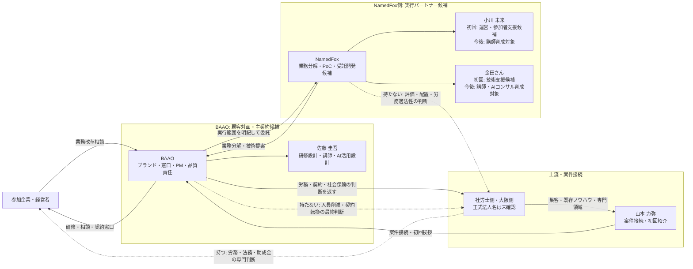

# 働き方4.0案件 MTG後の宿題・山本さんレビュー案

**作成日**: 2026-07-18
**状態**: 内部検討用。対外共有しない
**目的**: 初回ブートキャンプの日程・講師・依頼範囲を先に返し、上流側で案件が止まるのを防ぐ

## 1. 結論

最初に山本さんへ返すべきものは、価格表ではなく次の4点。

1. 初回ブートキャンプの仮日程
2. 初回に対応できる人数と実施形式
3. 講師プロフィール
4. BAAO・NamedFox側に依頼したい範囲と責任分界

ただし、MTGで説明された「Claude Codeの導入・Hello Worldまでの体験会」は山本さんの現時点の理解であり、上流側が正式に指定した研修仕様とはまだ確定しない。既存提案書には5時間のAI経営ワークショップがあるため、山本さんから上流側へ、所要時間、正式な研修範囲、持ち帰り成果物を確認してもらう。

初回の主講師候補は佐藤 圭吾とする。小川 未来さん・金田さんは、現時点では運営・技術ファシリテーターの候補に留め、研修仕様と条件を提示した後に本人とNamedFox法人へ参加可否を確認する。将来の講師担当は初回参加の条件にせず、本人が希望する場合に育成方法と認定条件を別途協議する。

## 2. 宿題管理

| 宿題 | 担当 | 現在地 | 次のアクション | 期限案 |
|---|---|---|---|---|
| 山本さんへのレビュー依頼 | 佐藤 | 本書に文案作成済み | Slackでレビュー依頼 | 7/18 |
| 依頼範囲の箇条書き | 佐藤 | 本書に作成済み | 山本さんが上流側向けに整形 | 7/19 |
| 仮スケジュール | 佐藤 | `gog`で佐藤側カレンダー確認済み | 上流仕様確定後、条件確認書で全員の可否確認 | 上流回答後 |
| 講師プロフィール | 佐藤 | 主講師の佐藤案作成済み | 役割合意後に本人から経歴を回収 | 役割合意後 |
| 実施方法と概算金額 | 実施候補者 | 依頼前 | 上流仕様と契約条件を提示後、個別回答 | 上流回答後 |
| 初回研修仕様の確定 | 山本 | 未確定 | 2時間体験会か5時間版か上流確認 | 7/21 |
| 正式な社労士法人名・関係者名 | 山本 | Graphで未解決 | 正式表記を上流確認 | 7/21 |

## 3. 山本さんが上流側へ確認する研修仕様

現時点ではA・Bのどちらも確定案としない。実施チーム側で勝手に2時間版へ決めず、山本さんが上流側の期待値を確認してからカリキュラムと見積を確定する。

### A. 2時間のClaude Code体験会案

- **対象**: AIに詳しくない経営者・経営幹部
- **時間**: 2時間
- **人数**: 10〜15名を上限とする
- **ゴール**: Claude Codeを動かし、「自社でも業務改革に使える」という実感を持つ
- **成果物**: 稼働環境、体験課題、業務改革相談への次アクション
- **位置づけ**: 山本さんの現時点の理解をもとにした短時間案。上流確認前には確定しない

運営上は、参加者約5名に対して1名の支援者を置く。10〜15名の初回は、佐藤が主講師として前に立ち、小川さん・金田さんが会場を回る3名体制を基本とする。50名規模の実績は参考値に留め、初回は品質を検証できる人数から始める。

#### 2時間の構成案

| 時間 | 内容 | 到達点 |
|---:|---|---|
| 0:00-0:15 | AIとClaude Codeでできること | 期待値を揃える |
| 0:15-0:40 | インストール・セットアップ | 全員が起動できる |
| 0:40-1:05 | Hello Worldと基本操作 | 自分で指示して結果を得る |
| 1:05-1:35 | 経営・業務の小課題を1つ実行 | 自社利用を具体化する |
| 1:35-1:50 | 自社業務への展開ワーク | 次に分析する業務を選ぶ |
| 1:50-2:00 | 次段階の案内 | 個別相談への導線を作る |

### B. AI経営×クエスト型ブートキャンプ

- **対象**: 経営者・幹部
- **時間**: 5時間
- **内容**: AIドリル、経営シミュレーション、AI経営チーム設計、90日計画
- **位置づけ**: 既存提案書を基にした本格商品
- **条件**: 教材、講師体制、事前準備、価格をAとは分けて設計する

### 山本さんに確認する事項

> 初回に上流側が期待している所要時間は2時間でしょうか、5時間でしょうか。研修範囲はClaude Codeの導入からHello Worldまででしょうか、それともAIドリル、経営シミュレーション、90日計画までを含みますか。参加者が持ち帰る必須成果物と、既存教材の利用条件も確認したいです。

## 4. 商流・責任分界

### 契約の仮置き

- BAAOが顧客対面、契約窓口、PM、品質管理を持つ
- NamedFoxは、明記された実行範囲を担うパートナーとする
- 初回研修と、その後の業務分析・PoC・受託開発は別見積・別SOWにする
- 業務分析後にSaaS導入で足りる場合は、受託開発を前提にしない
- 労務、契約転換、社会保険、助成金の判断は社労士・弁護士側へ返す

## 5. BAAO・NamedFox側に依頼したい範囲

山本さんが上流側へ戻すための箇条書き案。

1. **ブートキャンプ設計**
   - 対象者、人数、到達点、所要時間の設計
   - Claude Codeの環境準備、教材、当日台本の作成
2. **ブートキャンプ実施**
   - 講師、ファシリテーション、セットアップ支援
   - 当日のトラブル対応と参加者フォロー
3. **終了後のフォローアップ**
   - 参加企業へのヒアリング
   - 全社導入や業務改革に関心がある企業の個別相談
4. **業務分解・AIコンサル**
   - 対象業務の棚卸し
   - 人が担う業務、AI化候補、外部活用候補の整理
   - 効果、難易度、リスクによる優先順位付け
5. **要件整理・技術検証**
   - SaaS導入、AIワークフロー、個別開発の選択
   - PoC対象と成功条件の定義
6. **PoC・受託開発**
   - 合意した1業務からの小規模実装
   - 顧客固有部分と横展開可能部分の分離
7. **導入・定着支援**
   - 利用状況の確認、改善、追加開発
   - 再利用できる教材・テンプレート・事例への転換

### 対象外

- 解雇、雇用形態変更、評価、配置の最終判断
- 社会保険料削減の保証
- 助成金・補助金の採択または受給保証
- 本人への説明や同意設計を欠いたPCログ・労務データの取得

## 6. 仮スケジュール

以下はコミットメントではなく、上流側に「動ける時期」を返すための案。

| 日付 | マイルストーン | 担当 |
|---|---|---|
| 7/18 | 本書を山本さんへレビュー依頼 | 佐藤 |
| 7/19 | 上流確認事項と山本さんの意向を確認 | 山本・佐藤 |
| 上流回答後 | 初回条件確認書をNamedFox法人・小川・金田へ提示 | 佐藤 |
| 条件提示後 | 可否、担当範囲、工数、条件を個別回答 | NamedFox法人・小川・金田 |
| 全員回答後 | 実施体制・契約・価格を内部確定 | 関係者 |
| 7/31 | 体験会カリキュラム v0.1 | 佐藤・NamedFox側 |
| 8/5 | リハーサル・Go/No-Go | 実施チーム |
| 8/8 または 8/22 | 初回パイロット候補 | 実施チーム |

### 日程確認結果

- 第1候補日: **2026-08-08（土）**
- 第2候補日: **2026-08-22（土）**
- 2026-07-18時点で、`gog calendar freebusy`により佐藤側のUnson・個人・SalesTailor・NCOM・BAAO各カレンダーに終日の競合なし
- 金田さん・小川さん、会場、上流側の都合は未確認
- 開始・終了時刻は、山本さんが上流側へ研修時間を確認した後に設定する

## 7. 講師体制と育成方針

### 初回の体制

| 役割 | 担当 | 責任範囲 |
|---|---|---|
| 主講師 / Lead Instructor | 佐藤 圭吾 | 研修設計、経営者向け説明、全体進行、品質判断、次段階への接続 |
| 運営ファシリテーター候補 | 小川 未来 | 受付・進行補助、セットアップ、参加者フォロー、個別相談への接続 |
| 技術ファシリテーター候補 | 金田さん | インストール・演習支援、技術質問、業務分解・AIコンサルへの接続 |
| 案件接続・冒頭挨拶 | 山本 力弥 | 案件背景と上流側の紹介。研修講師は原則担当しない |
| 専門領域 | 社労士・大阪側 | 必要時の事例・制度説明。AI研修の講師体制には含めない |

小川さん・金田さんは、本人の登壇経験と対応可能範囲を確認するまでは、対外的に主講師とは表記しない。

### 今後の講師移管（本人が希望する場合の内部仮説）

| 段階 | 実施回 | 体制 | 合格条件 |
|---|---:|---|---|
| 型を作る | 回数未定 | 佐藤が主講師、希望者が副担当 | 台本、環境確認表、FAQ、演習、トラブル対応表が揃う |
| 部分移管 | 本人合意後 | 希望者が一部パートを担当、佐藤が監修 | 技能チェックと参加者支援品質の基準値を事前合意する |
| 通常運営 | 認定後 | 認定講師が合意した回を担当 | 評価者、合格・再評価・辞退条件を明文化する |

### 講師レイヤー

- **Lead Instructor**: 経営者との対話、全体進行、研修品質に責任を持つ
- **Facilitator**: セットアップ、演習、参加者支援を担当する
- **AI Consultant**: 研修後の業務分解、提案、PoCへの接続を担当する

研修登壇と、研修後のAIコンサル・受託開発は別の役割・対価として設計する。講師品質と営業成果も分けて評価する。教材、講師基準、品質責任、NamedFox側での再利用条件は、法人・本人を含む関係者合意後に確定する。

## 8. 対外プロフィール案

### 佐藤 圭吾

一般社団法人 ビジネスAI推進機構（BAAO）理事。複数事業でCEO・CTO・生成AIエキスパートを務め、生成AIを活用した業務設計、AIエージェント、業務システム実装、企業研修を支援。研修だけで終わらせず、業務分解からPoC、運用定着までを一貫して設計する。

### 小川 未来

Graph SSOT上の役割は「オペレーション／開発補助（業務委託）」、関与プロジェクトはBAAOを含む。初回は運営・参加者支援のファシリテーター候補とし、登壇経験、担当可能パート、顧客フォロー経験を本人確認してから対外プロフィールを確定する。

### 金田さん

Graph SSOTでは人物を特定できていない。初回は技術ファシリテーター候補とし、NamedFoxでの正式役職、得意領域、登壇経験、AIコンサル・開発実績、対外表記を本人確認してから掲載する。

## 9. 山本さんへのSlackレビュー依頼案

> 山本さん、本日の内容を踏まえて、上流側へ戻す前のレビュー案を作りました。まずスピード優先で、以下を先に返す想定です。
>
> - 初回候補日: 8/8（土）、予備 8/22（土）。時間帯は研修時間の確認後に設定
> - 初回規模: 10〜15名程度
> - 初回講師体制: 佐藤が主講師。小川さん・金田さんは運営・技術ファシリテーター候補として調整
> - BAAOがブランド・顧客窓口・PM・研修設計を持ち、NamedFox側には運営支援、終了後フォロー、業務分解、AIコンサル、必要時のPoC・受託開発をお願いする
> - 労務・契約転換・社会保険・助成金の専門判断は社労士側に戻す
>
> MTGで伺った「Claude Code導入〜Hello World中心」という内容は山本さんの現時点の理解として受け止めています。既存提案書の5時間版とは準備体制と価格が変わるため、上流側へ、所要時間、正式な研修範囲、持ち帰り成果物をご確認いただきたいです。
>
> この立て付けで問題なければ、上流側の回答後に条件確認書を作り、NamedFox法人、小川さん、金田さんへそれぞれ参加可否、対応範囲、工数、条件を確認します。将来の講師担当は初回とは切り離し、本人が希望する場合に別途協議します。

## 10. 金田さん・小川さんへの依頼案（上流回答後に作成）

> 今日のMTGありがとうございました。上流側の研修仕様が確認できたため、別紙の「初回条件確認書」をご確認ください。現時点では参加や将来の講師担当を確約いただくものではありません。
>
> 1. 候補日時の参加可否と、準備・当日・事後に確保できる時間
> 2. 初回研修で担当したい範囲、条件付きで可能な範囲、担当できない範囲
> 3. 必要な事前説明、環境検証、教材、リハーサル
> 4. 報酬、交通費、契約、日程変更・キャンセル等の条件
> 5. NamedFox法人としての受託範囲と、各個人の参加条件
>
> 初回の役割は本人とNamedFox法人の合意後に確定します。研修後のAIコンサル・開発支援と、将来の講師移管は初回研修とは別に協議します。別紙の条件が不足している場合は、見積や参加可否を回答せず、不足事項をご指摘ください。

## 11. 次に佐藤がやること

1. 山本さんへ確認専用のレビュー資料を送り、上流仕様と山本さんの意向を確認する
2. 回答後、「初回条件確認書」を埋める
3. NamedFox法人、小川さん、金田さんへ別々に受諾可否と条件を確認する
4. 回答を受けて、体制・価格・講師プロフィールを確定する
5. 初回仕様が確定したら、カリキュラムと見積を作る。講師育成は希望者と別途協議する

現時点では、Slack送信、カレンダー登録、対外確約は行っていない。

## 12. 根拠と未確認事項

### Graph SSOTで確認済み

- BAAOの正本名: 一般社団法人 ビジネスAI推進機構
- 山本 力弥: BAAOの代表理事を含む役割
- 佐藤 圭吾: BAAO理事を含む役割
- 小川 未来: BAAO関与、オペレーション／開発補助

### Graph SSOTで未解決

- NamedFox
- 金田さん
- 働き方4.0
- AI経営×クエスト型ブートキャンプ
- 社労士法人・大阪側関係者の正式名称

NamedFoxと金田さんの表記はユーザー確認を正として採用した。個人KGは今回の案件名・関係者・導線に一致する記録が見つからなかった。

### 議事録の根拠

- 10:55〜15:48: 初回はClaude Code導入・Hello World、後続は業務分析・業務分解・AIコンサル・要件定義・受託開発
- 17:35〜18:36: ブートキャンプ後のフォローアップ・営業も依頼範囲の候補
- 21:36〜26:30: BAAOがブランド・窓口・顧客対面を持ち、開発会社との役割分担を明記
- 24:18〜27:07: 最優先は仮日程、講師プロフィール、依頼範囲、実施方法と概算の返答
- 27:54〜29:12: 初回人数はこちらから提案可。大阪側の過去規模は約50名
