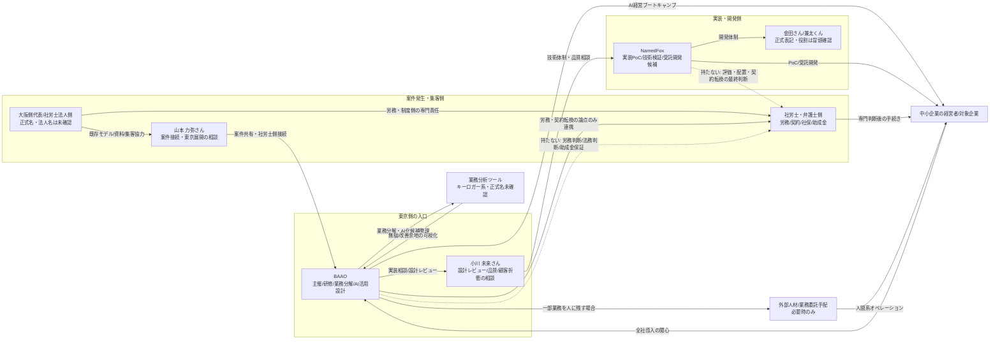
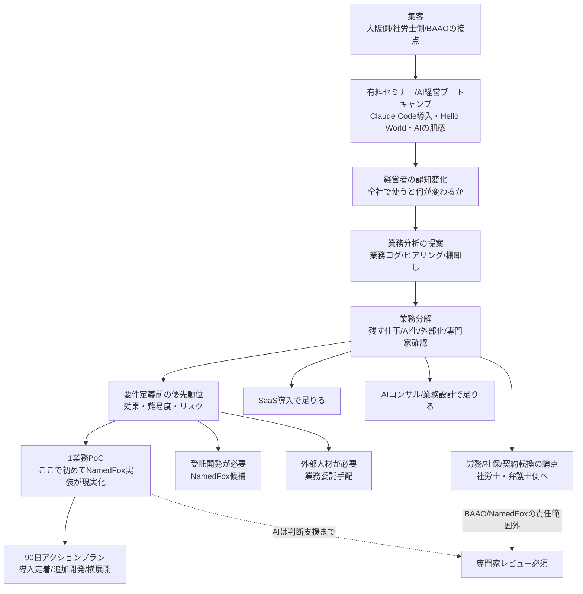
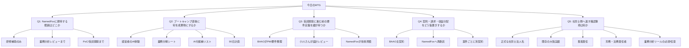

# NamedFox 初回MTG準備（働き方4.0 / AI経営ブートキャンプ）

Date: 2026-07-18

## 位置づけ

今日のMTGは「この案件を受けるか」を即決する場ではなく、BAAOがAI実装・業務設計として入る場合に、NamedFox側がどこを担えるかの現実感を取る場。

山本さん経由で受領した資料は、表向きにはAI研修・業務再設計・AI経営ブートキャンプだが、背景には評価再配置、契約整理、外部人材活用、社保削減に見える論点が含まれる。BAAOが前面に出るなら、労務判断・法務判断・助成金保証は持たず、AI実装と業務分解に切る。

## 立て付けの図

### 1. 全体の商流・責任分界

### 2. ブートキャンプから案件化までの導線

### 3. 今日のMTGで潰す論点

### 4. 役割の仮置き

```mermaid
flowchart LR
  subgraph BAAORole["BAAOが持つ"]
    B1["主催/看板"]
    B2["AI研修"]
    B3["業務分解"]
    B4["AI化候補整理"]
    B5["山本さん側への返答整理"]
  end

  subgraph OgawaRole["小川さんに相談"]
    O1["研修・設計の品質"]
    O2["顧客折衝の現実感"]
    O3["PoC前の要件整理レビュー"]
  end

  subgraph NFRole["NamedFoxに相談"]
    N1["技術実現性"]
    N2["PoC範囲"]
    N3["見積レンジ"]
    N4["受託/準委任/月額伴走の向き不向き"]
  end

  subgraph LaborRole["社労士・弁護士側が持つ"]
    L1["労務判断"]
    L2["契約転換"]
    L3["社会保険・助成金"]
    L4["評価/配置の最終判断"]
  end

  BAAORole --> OgawaRole --> NFRole
  BAAORole -. "専門判断は持たない" .-> LaborRole
  NFRole -. "判断ロジックではなく実装に限定" .-> LaborRole
```

## 固有名詞確認

- NamedFox: ユーザー修正によりこの表記を採用。Graphでは未解決
- 小川さん: Graph SSOTで「小川 未来」として high confidence / project `baao`
- 山本さん: Graph SSOTで「山本 力弥」として high confidence / project `baao`
- 金田さん / 兼太くん: 前回ユーザー修正では「金田」。今回ユーザー発話では「兼太くん」。Graphでは未解決。冒頭で同一人物か、正式表記・呼称を確認する

冒頭で聞く:

> まず表記だけ確認させてください。NamedFoxさん側は、小川さんと兼太くんで、対外資料ではどの表記にするのが正しいですか？また、前に出ていた金田さんと兼太くんは同一人物で合っていますか？

## 60秒の切り出し

山本さんから、社労士法人さんの「働き方4.0 / AI経営ブートキャンプ」系の資料を受け取りました。AI研修だけで終わらせず、業務分解、AI化候補整理、90日アクションプラン、必要なら実装までつなげる話です。

一方で、評価再配置や外部人材化、社保削減に見える論点も入っているので、BAAOとしては労務・法務判断は持たず、AI実装と業務設計に役割を限定したいです。今日はNamedFox側が受託開発・技術実装としてどこまで担えるか、初回PoCをどう切るかを相談したいです。

## 今日決めたいこと

1. NamedFoxが担える範囲
2. BAAO、小川さん、NamedFox、山本さん側の役割分担
3. 初回PoCの最小成果物
4. 山本さんへ返す宿題・確認事項

## 商品の切り方

### 1. AI経営ブートキャンプ

- 経営者・管理職向けの5時間研修
- Claude Code / ChatGPT / Gemini / OpenAI APIなどの実務体験
- 経営シミュレーションと90日アクションプラン作成

### 2. 業務分解・AI化候補整理

- 既存業務を棚卸し
- 人がやる仕事、AIに寄せる仕事、外部パートナーに任せる仕事を分類
- 評価・再配置の最終判断は社労士/弁護士側に委ねる

### 3. PoC / MVP実装

- 議事録、ファイル、CRM、SaaS、社内ナレッジなどのAI活用
- Claude Code / MCP / ワークフロー自動化
- 1社ごとの小さな業務改善PoCから始める

### 4. 伴走・追加開発

- 月次伴走
- 顧客別の追加実装
- テンプレート化できる部分は横展開

## NamedFoxに聞くこと

### 開発範囲

- フロントエンド、バックエンド、LLM連携、MCP、業務システム連携のうち、NamedFoxで担いやすい領域はどこか
- 社内ファイル、CRM、Slack、Google Drive、議事録、勤怠/評価データなどが絡む場合、何が前提条件になるか
- 顧客ごとの個別実装と、横展開できるテンプレート実装の境界はどこか

### 体制・見積

- 初回1社PoCなら、期間と費用レンジはどれくらいが現実的か
- 固定範囲の請負、準委任、月額伴走のどれが合うか
- BAAOが要件整理・AI設計を持ち、NamedFoxが実装を持つ形は成立するか

### リスク

- 個人情報、労務データ、評価データを扱う場合に避けるべき実装は何か
- AIの出力を評価・配置判断に使う場合、どこまでなら実装可能で、どこから専門家レビュー必須か
- 顧客に「AIで人員削減」と見える提案にならないため、実装側で注意すべき表現・機能は何か

## 小川さんに聞くこと

- BAAOが持つべき役割は、研修講師、業務設計、PM、AI実装監督のどこまでか
- NamedFoxを入れる場合、小川さんは開発監督・品質確認・顧客折衝のどこを担うのが自然か
- 山本さん側に次回返すとき、どの粒度の提案にするのがよいか
- 初回商談で見せるなら、どの成果物が一番刺さるか

## 避ける表現

- AIで社員を削減する
- 社保を下げる
- 外注化で固定費を削る
- 助成金が取れる
- AIが評価や配置を判断する

## 使う表現

- 仕事を分解し、人・AI・外部パートナーの最適配置を設計する
- 人が価値を出せる仕事に戻す
- AIは判断を支援し、最終判断は人と専門家が行う
- 労務・法務論点は社労士/弁護士のレビュー前提で進める
- BAAOはAI活用設計と実装支援に責任範囲を置く

## 30分アジェンダ

| 時間 | 内容 |
|---:|---|
| 0-3分 | 表記確認、今日のゴール共有 |
| 3-8分 | 山本さん案件の背景共有 |
| 8-15分 | 商品を「研修 / 業務分解 / PoC / 伴走」に分解 |
| 15-22分 | NamedFoxが担える開発範囲・体制・見積感を確認 |
| 22-27分 | 労務・法務・表現リスクの境界確認 |
| 27-30分 | 山本さんへ返す宿題と次回MTG候補を決める |

## 初回PoC案

最小形は以下がよい。

1. AI経営ブートキャンプの実施
2. 参加企業の業務分解シート作成
3. AI化候補の優先順位付け
4. 1業務だけ小さくAI実装PoC
5. 90日アクションプランに落とす

NamedFoxには 4 の実装PoCを中心に、必要なら 2-3 の技術観点レビューも担ってもらう。

## 山本さんへ返す確認事項

- 社労士法人名・資料上の正式表記
- 編集可能な提案資料の有無
- 初回想定顧客の業種・規模・課題
- 既存の大阪実績や受注済み事例
- BAAO / NamedFox / 社労士側の収益分配イメージ
- 労務・法務判断の最終責任者
- AI実装まで含めた提案にしてよいか

## MTGの着地点

最後はこう締める。

> 今日の結論としては、BAAOはAI研修と業務分解、NamedFoxは実装PoC、労務・法務判断は山本さん側の専門家、という分担で一度仮置きしたいです。その前提で、初回1社向けの最小PoCと概算レンジを整理して、山本さんに返す形でよいですか？
