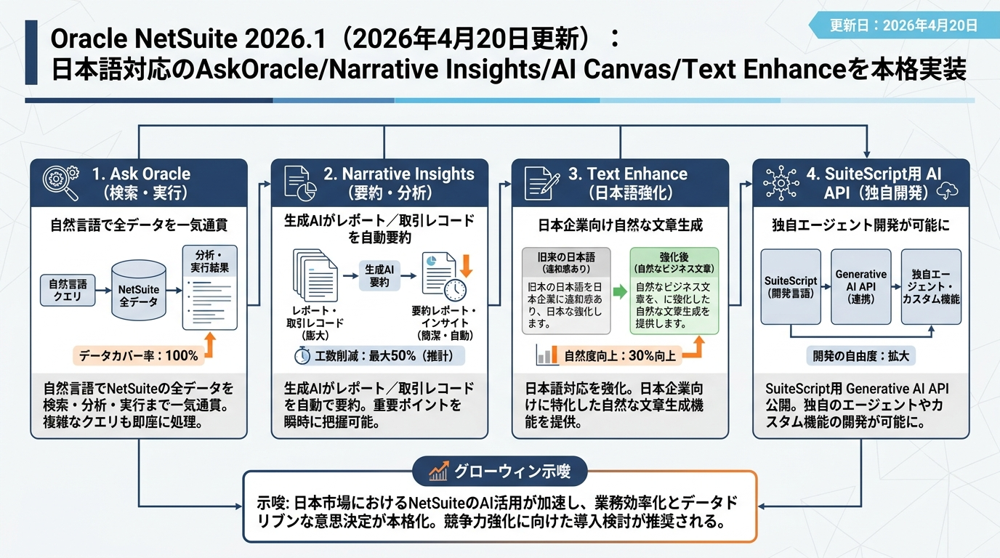
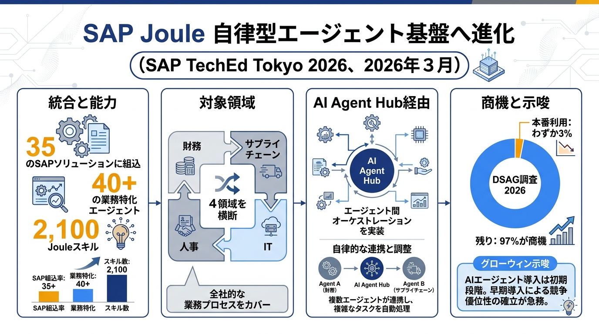
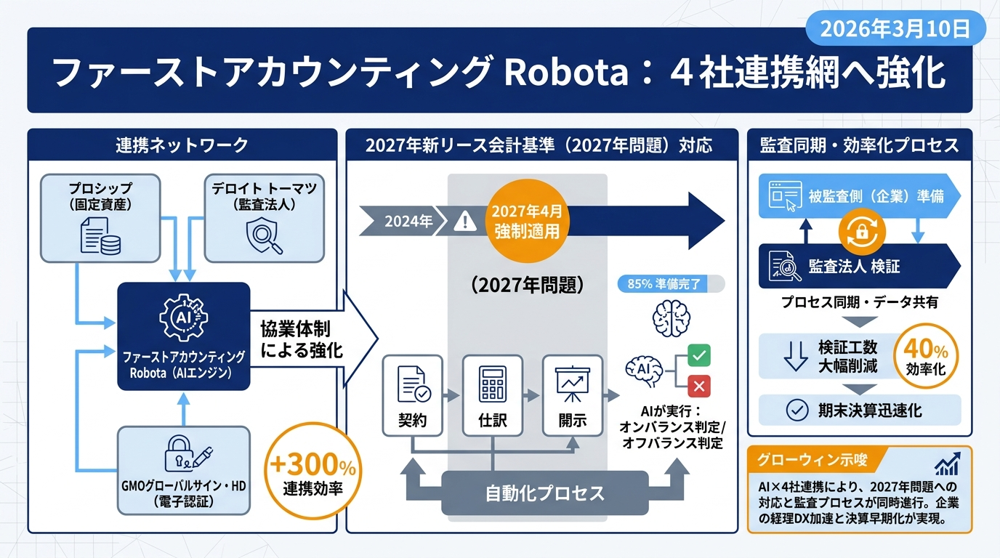
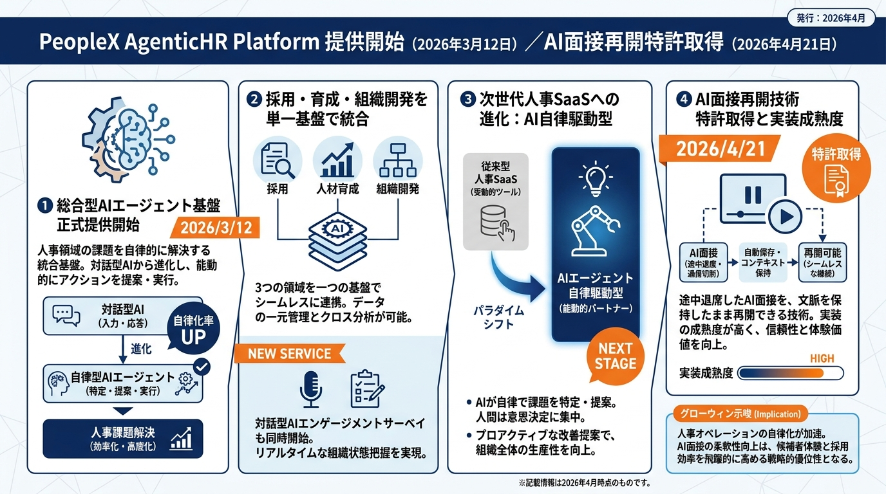
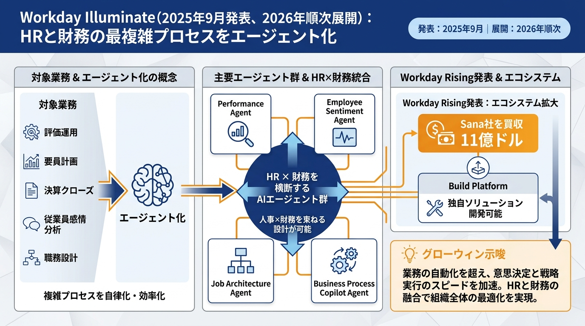
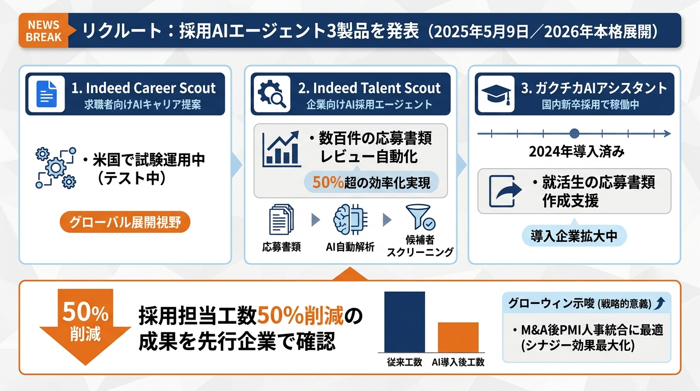
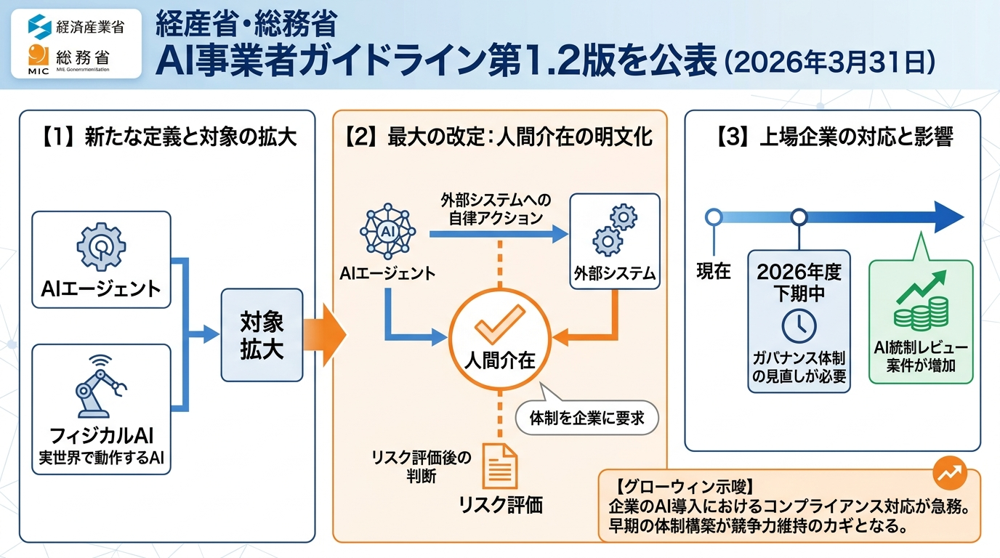
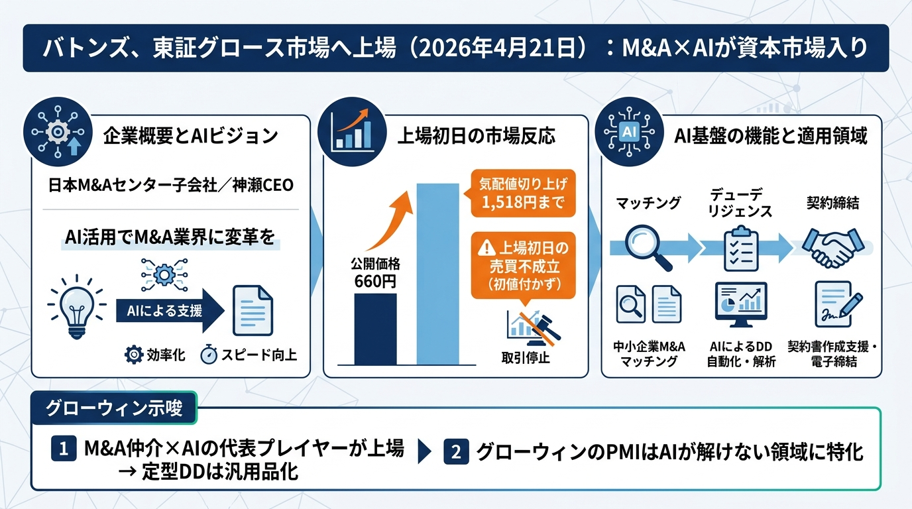
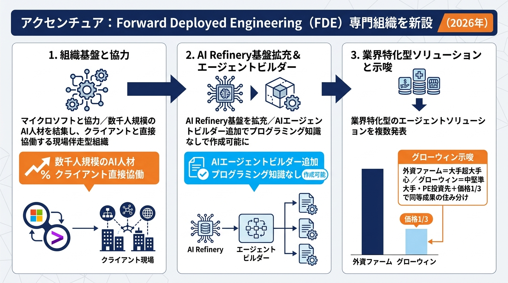

# AI最新ニュース・ダイジェスト

**作成者**: 佐藤圭吾
**作成日時**: 2026年4月22日 09:00
**タグ**: 2026-04-22
**用途**: グローウィン・パートナーズ様向け 定例コンサル 冒頭ニュース共有
**期間**: 2026年3月中旬〜2026年4月中旬
**構成**: バックオフィス領域に直結するニュースを厳選 → グローウィン様への示唆

---

## エグゼクティブサマリー

3月版では「AIが検索支援から決算・照合の実務に入り始めた」と述べましたが、**この1ヶ月でAIが"アシスタント"から"エージェント基盤"へと明確に位置づけ直される動き**が相次ぎました。

- **経理・ERP**: Oracle NetSuiteが「NetSuite Next」系列の2026.1で**日本語Text Enhance・Ask Oracle**を前面化。SAPは「Joule」を**35ソリューション×40エージェント**の自律型エージェント基盤へ拡張（TechEd Tokyo 2026）。ファーストアカウンティングは**Robotaを監査法人・固定資産ベンダー・電子認証事業者と一体の連携網**へ進化
- **人事・総務AI**: PeopleXが**AgenticHR Platform**の提供を正式開始（3/12）、Workdayは**Illuminate**で評価運用・要員計画・決算クローズまでエージェント化。リクルートの**Indeed Talent Scout／Career Scout**も国内展開へ
- **導入の勝ち筋**: 経産省・総務省が**AI事業者ガイドライン v1.2**（3/31）で自律型AIエージェントへの人間介在（Human-in-the-Loop）要件を明文化。**バトンズが東証グロース上場**（4/21）でM&A×AIが資本市場入り。アクセンチュアは**Forward Deployed Engineering（FDE）**専門組織を設立
- **グローウィン様への意味**: 「AI×人事制度」「AI×経営管理」「AI×内部統制」「AI×M&A PMI」のすべてが**制度・商品として具現化した1ヶ月**。3月版は「方針」の話でしたが、今月からは**具体プロダクトと統制要件に即して価格・工数を語れる**段階に入りました

---

## 1. 経理・ERP領域：AIが「エージェント基盤」として再定義された

### Oracle NetSuite、2026.1で「Ask Oracle」「Narrative Insights」など日本語AI機能を本格拡充（2026年4月）

- 2026.1リリースノートが2026年4月20日更新。**Narrative Insights**（生成AIによるレポート・レコードの要約）、**Ask Oracle**（自然言語でNetSuite全データを検索・分析・実行）を実装
- **NetSuite Text Enhance** の日本語対応を強化。日本企業向けに自然な日本語生成を提供
- 2025年10月に発表した「NetSuite Next」の実体化。**AI Canvas**（データとアクションを結ぶ協業ワークスペース）も提供
- SuiteScript用の**Generative AI API**を公開し、カスタム拡張への組み込みが可能に

**グローウィン示唆**
- 3月版の「NetSuite AI機能発表」が、4月で**Ask Oracle×日本語Text Enhance**として実装フェーズに到達。グローウィンのNetSuite導入実績に「**AI機能アクティベーション＋FP&A再設計**」というメニューを上乗せできる
- **経営管理改革**の文脈で、「月次決算を短縮した後の空いた工数を、Ask Oracleによる**事業部門への分析提供**に転換する」という具体提案が刺さる
- BPO側では、カスタム拡張（Generative AI API）を使って**グローウィン専用の業界別AIエージェント**を作り込み、差別化資産化する余地あり

**出典**: [Oracle 日本「NetSuite、NetSuite Nextを発表」](https://www.oracle.com/jp/news/announcement/sw25-netsuite-launches-netsuite-next-2025-10-07/) / [NetSuite AI Documentation 2026.1](https://docs.oracle.com/en/cloud/saas/netsuite/ns-online-help/article_3075606603.html)

### SAP、「Joule」を35ソリューション×40エージェントの自律型エージェント基盤に拡張（SAP TechEd Tokyo 2026、3月）

- 2026年第1四半期、SAP JouleはAIアシスタントから**本格的なエージェント基盤**へ進化。35のSAPソリューションに組み込まれ、40以上の業務特化エージェントを提供
- SAP TechEd Tokyo 2026の基調講演で、**40以上のJouleエージェント・2,100のJouleスキル・AI Agent Hub経由のエージェント間オーケストレーション**を公開
- 対象は財務・サプライチェーン・人事・ITの4領域。**受動型AI（指示待ち）から自律型AI（計画・実行まで自走）への転換**を明言
- ただし**DSAG投資動向調査2026では、SAP Business AIを本番利用しているSAPユーザーは3%**にとどまる

**グローウィン示唆**
- **「3%しか本番利用していない」ギャップがグローウィンの商機**。SAP導入済みのクライアントに対し、**Jouleエージェントの有効化＋業務再設計＋統制設計**のパッケージを提案できる
- 特に**PEファンドのバリューアップ**案件で、投資後100日プランに「SAP Signavioで可視化→Jouleエージェントで自動化→KPIダッシュボード化」という定量KPIを組み込める
- **エージェント間オーケストレーション**は、グローウィンが強い**経営管理×ERP×人事**の領域横断設計と相性が良い。単一SaaSの導入支援から、**エージェント間の責任分界設計**に提案軸を上げられる

**出典**: [SAP日本「Joule スタジオ」](https://www.sap.com/japan/products/artificial-intelligence/joule-studio.html) / [SAP TechEd Tokyo 2026 Keynote レポート](https://mysap2015.wordpress.com/2026/03/19/sap-teched-tokyo-2026%E3%80%80keynote/)

### ファーストアカウンティング、Robotaを監査法人・固定資産ベンダー・電子認証事業者と一体の連携網へ強化（2026年3月10日）

- 「2027年問題」（2027年4月からの新リース会計基準強制適用）に向けて、経理AIエージェントの連携網を**プロシップ・デロイト トーマツ・GMOグローバルサイン・HD**と強化
- すでに2025年8月6日に**新リース会計基準対応版**の経理AIエージェントを発表済み
- 契約情報の識別・入力、オンバランス／オフバランス判定、使用権資産・リース負債の計上を自動化
- 監査法人（デロイト）を巻き込むことで、**被監査側の準備と監査法人の検証プロセスが同期**する構図に

**グローウィン示唆**
- 3月版で触れた「プロシップ×ファーストアカウンティング資本業務提携」が、今月で**監査法人と電子認証事業者まで巻き込んだ4社連携網**に拡張。業界の勝者候補がほぼ固まった
- グローウィンの**経営管理コンサル**に、「Robota連携網の導入支援＋開示資料準備の代行」を一体化したメニューを組めば、**2027年4月の強制適用**の波に最も早く乗れる
- 監査法人（デロイト）側がすでに動いているため、「**グローウィンが被監査側の運用設計とデータ整備を代行する**」ポジションが明確に取れる。特にIFRS適用済の中堅成長企業・PE投資先が主戦場

**出典**: [ファーストアカウンティング公式「2027年問題に向けた連携網強化」](https://www.fastaccounting.jp/news/20260310/15792/) / [同「新リース会計基準対応AIエージェント発表」](https://www.fastaccounting.jp/news/20250806/15134/)

---

## 2. 人事・総務領域：AIが「採用・育成・組織開発」の基盤に

### PeopleX、「AgenticHR Platform」を正式提供開始（2026年3月12日）／AI面接再開特許取得（4月21日）

- 3月12日の「PeopleX AI Momentum 2026」で、人事領域の総合型AIエージェント基盤**「PeopleX AgenticHR Platform」**の提供を正式開始
- 対話型AIで得られたデータに基づき、**AIエージェントが自律的に人事課題を特定し、解決策を提案**する構造。従来の人事SaaSの次の形
- 採用・人材育成・組織開発を一つの基盤で統合。対話型AIエンゲージメントサーベイ市場にも3月末から本格参入
- 4月21日に**「途中退席したAI面接を再開できる技術」の特許を取得**。実務運用を想定した改善を重ねている

**グローウィン示唆**
- グローウィンの**人事制度コンサル**と、PeopleXの実装層が接続しやすい設計になってきた。「制度設計（グローウィン）→AgenticHR Platform実装（PeopleX）→定着BPO（グローウィン）」の三点セットが組める
- 特に**評価制度リニューアル**や**タレントマネジメント**案件は、「運用自動化込みの制度設計」として再構成すると、従来の単価を大きく引き上げられる
- Talent Growth Hub部の尾田さんの領域に直結。**グローウィン社内でAgenticHR Platformを先行試験導入**し、自社事例として外販化するのが王道。特に「**AI面接の運用改善は特許レベルで攻めている企業と組むべき**」という訴求は、大手人事部長に刺さる

**出典**: [PeopleX「AgenticHRプラットフォーム提供開始」](https://peoplex.jp/news/20260312_01) / [同「AI面接再開特許取得」](https://peoplex.jp/news/20260421)

### Workday Illuminate、評価運用・要員計画・決算クローズまでエージェント化（2026年展開）

- 2025年9月16日発表、2026年にかけて順次提供。**人事・財務・業界別の横断でAIエージェントを拡充**
- 追加エージェントは **Business Process Copilot Agent**（業務プロセス設定・自動化）、**Employee Sentiment Agent**（従業員感情分析）、**Job Architecture Agent**（職務設計）、**Performance Agent**（評価運用）、**Case Agent**（問い合わせ解決時間短縮）、**Document Intelligence for Contingent Labor Agent**（業務委託の発注書自動生成）など
- 対象業務は**評価運用・要員計画・決算クローズ**など、人事と財務の最も複雑なプロセス
- Workday Risingで**Build Platform**（独自AIソリューション開発基盤）と**Sana社11億ドル買収**も発表。基盤拡張が続く

**グローウィン示唆**
- 3月版で触れた「Workday AI 17億アクション」から、4月までに**具体エージェント群の提供準備**に到達。グローウィンは「**Illuminate前提の運用設計**」という新コンサルメニューを作れる
- 特に**後継者計画・役員育成**は、Job Architecture AgentとPerformance Agentが直接刺さる。グローウィンの役員人事メニューと組み合わせて**外資系／大手日系向けの目玉商品**にできる
- **財務側のFinancial Close Agent**は、経理部門にも提案できる接点。**人事×財務を束ねるコンサル**（＝グローウィンの強み）に最も合う

**出典**: [Workday Newsroom「Illuminate Expands with New AI Agents」](https://newsroom.workday.com/2025-09-16-Workday-Illuminate-TM-Expands-with-New-AI-Agents-for-HR,-Finance,-and-Industry)

### リクルート、採用AIエージェント3製品を発表（「Indeed Career Scout」「Indeed Talent Scout」「ガクチカAIアシスタント」）

- 2025年5月9日の決算説明会で発表、2026年にかけて本格展開
- **Indeed Career Scout**：求職者向けAIキャリアエージェント（米国で試験運用中）。現在の職種を超えたキャリア提案・必要ステップ・想定給与を提示
- **Indeed Talent Scout**：企業向けAI採用エージェント。数百件の応募書類レビューを自動化
- **ガクチカAIアシスタント**：国内新卒採用で成果。就活生の応募書類作成支援として既に稼働中

**グローウィン示唆**
- クライアントの**採用戦略コンサル**の新メニュー化が可能。「Indeed Talent Scout導入を前提とした採用業務の再設計」「ガクチカAIアシスタント時代の新卒採用プロセス見直し」
- 特に**M&A後のPMI人事統合**では、旧組織の採用プロセスを一気に標準化・AI化する絶好のタイミング。グローウィンの既存M&A人事コンサルと直結
- 採用担当の工数削減効果が見えるため、**成功報酬型の提案**（削減工数×単価の一定割合を報酬化）も設計可能

**出典**: [リクルート決算説明会 / Indeed Career Scout・Talent Scout発表（トラコム解説）](https://www.tracom.co.jp/tralog/indeed-new-service/)

---

## 3. 導入の勝ち筋：AIエージェントの統制・組織体制・M&A市場

### 経産省・総務省、「AI事業者ガイドライン v1.2」公表（2026年3月31日）— 自律型AIエージェントに人間介在を明文化

- 総務省と経済産業省が共同で **AI事業者ガイドライン第1.2版**を公表
- 最大の改定点は **AIエージェント規制**：AIエージェントが外部システムに自律的に行動する際に**人間の判断介在（Human-in-the-Loop）**を求める
- AIエージェントと**フィジカルAI**（実世界で動作するAI）を新たに定義。リスク評価後に人間が判断を介在する体制を企業に要求
- 背景にはAIエージェント・フィジカルAIの技術進展と社会実装の加速、そこで顕在化するリスクへの対応

**グローウィン示唆**
- グローウィンの**内部統制・J-SOX・コーポレートガバナンス**のコンサル資産に、**「AIエージェント統制レビュー」**という新メニューを追加する絶好機
- NetSuite・Workday・Joule・PeopleXなどのエージェントが導入済のクライアントに対して、**ガイドラインv1.2準拠のギャップ診断**を能動的に提案できる
- 監査法人との差別化ポイントは「**業務設計から統制設計まで一気通貫で作れる**」こと。監査法人は検証側、グローウィンは**被監査側の運用を作れる**という独自ポジション

**出典**: [AI事業者ガイドライン（第1.1版）概要 総務省・経産省](https://www.meti.go.jp/shingikai/mono_info_service/ai_shakai_jisso/pdf/20250328_2.pdf) / [v1.2版解説記事（ailead Blog）](https://www.ailead.app/blog/ai-governance-guideline-v12-agent-regulation-2026)

### バトンズ、東証グロース上場（2026年4月21日）— M&A×AIが資本市場入り

- 日本M&Aセンター子会社のバトンズが2026-04-21に東証グロース市場へ上場
- 神瀬CEO「**AI活用でM&A業界に変革を**」と宣言
- 初値付かず（公開価格660円に対し気配値1518円まで切り上げ、**上場初日の売買不成立**＝期待の強さ）
- 中小企業M&Aのマッチング〜デューデリジェンス〜契約締結までをAIで支援する基盤。**M&A仲介×AIの代表プレイヤーが資本市場入り**

**グローウィン示唆**
- グローウィンの**M&A／PMI**コンサル領域と、バトンズAIの**直接競合／補完関係**が発生。戦略の再定義が必要：「**AIが扱えない複雑領域（人事統合・経営管理統合・財務統合）にグローウィンが特化**」
- PMI支援AIが本格化する前の今は、「**AIでは解けないPMI論点を整理する**」ホワイトペーパーをグローウィンが先出しする好機
- 既存クライアントへの能動的な声掛けが可能：「**バトンズ上場＝M&A×AIが本格普及の段階に入った**。グローウィンのPMI支援（特に人事統合・経営管理統合）を先に確保しませんか」

**出典**: [日本経済新聞 2026-04-21「バトンズ上場」](https://www.nikkei.com/) / バトンズ上場プレスリリース

### アクセンチュア、**Forward Deployed Engineering（FDE）**専門組織を新設（2026年）

- マイクロソフトと協力し、**数千人規模のAI人材を結集し、クライアントと直接協働する現場伴走型の開発組織（FDE）**を設立
- 同時に**AI Refinery基盤**を拡充。**AIエージェントビルダー**を追加し、プログラミング知識なしでエージェントを作成・カスタマイズ可能に
- 業界特化型のエージェントソリューションも複数発表
- EYは**「Agentic Web」**を2026年テーマに据え、AIエージェントが自律的にWeb上で行動する未来の決済プロトコルをセミナー展開（2026年2月26日）

**グローウィン示唆**
- 外資ファームが**大手・超大手中心**に動く中、グローウィンは**中堅〜準大手・PE投資先**という最適領域を取りに行く構図が明確
- 「外資ファームが入れない領域（中堅企業のERP×人事×AIの統合）」を主戦場と定義し、**価格は外資の1/3程度で同等成果**を打ち出すと競争力が高い
- 特にアクセンチュアの**FDE組織**は、グローウィンの**伴走型コンサル**と発想が近い。「**グローウィンは中堅企業のCFO領域における現場伴走型コンサル（Financial FDE）**」とポジション宣言できる

**出典**: [アクセンチュア「FDE組織設立」](https://newsroom.accenture.jp/jp/news/2026/accenture-launches-microsoft-forward-deployed-engineering-practice-to-help-organizations-scale-ai-across-the-enterprise) / [同「AI Refinery拡充」](https://newsroom.accenture.jp/jp/news/2025/release-20250415) / [EY「Next in Tech 2026 Agentic Web」](https://www.ey.com/ja_jp/media/webcasts/2026/02/ey-consulting-2026-02-26)

---

## グローウィン様にとっての論点整理

### 1. クライアント向けの新しい提案余地
- **経理財務**: NetSuite 2026.1（Ask Oracle／Text Enhance）の実装支援／SAP Joule有効化コンサル（3%しか本番利用していない層が商機）／Robota連携網の導入＋新リース会計基準対応BPO
- **人事**: PeopleX AgenticHR Platform前提の人事制度リニューアル／Workday Illuminate前提の後継者計画再設計／Indeed Talent Scout時代の採用業務再設計
- **ERP／DX**: SAP Joule×Signavioによる業務可視化と自動化／エージェント間オーケストレーションを前提とした経営管理×人事×ERPの横断設計
- **BPO／運用設計**: AIエージェント統制レビュー（ガイドラインv1.2準拠）／AIが弾いた例外処理のみを巻き取る人間＋AIの併用型BPO／独自AIエージェント開発（Generative AI API活用）

### 2. 自社でも先に使うべき領域
- **PeopleX AgenticHR Platform**をグローウィン社内で先行導入→自社事例として外販化（特にTalent Growth Hub部の評価・配置業務を対象に）
- **NetSuite Ask Oracle**を自社の経理BPOで使いこなし、クライアントへ移植できる状態を作る
- **AI事業者ガイドラインv1.2準拠の社内AIガバナンス体制**を4月中に整備し、それ自体を**提案資産化**する
- **アクセンチュアのFDE組織**の立ち位置を研究し、グローウィン版「CFO領域の現場伴走型コンサル」として言語化

### 3. 今後の勝ち筋
- **外資ファームとの棲み分け**：外資は大手超大手、グローウィンは中堅〜準大手＋PE投資先、価格は外資の1/3で同等成果
- **AIが解けない領域を主戦場化**：バトンズAI上場でM&Aマッチング・定型DDは汎用品化。人事統合・経営管理統合・財務統合のような"AIが解けない領域"にグローウィンが特化することで、**単価は維持・向上**
- **3点セット（制度設計×AI実装×BPO定着）＋統制レビュー**を標準商材化。外資ファームでも監査法人でも代替しにくい独自のポジション
- **連携網への参加戦略**：ファーストアカウンティング×プロシップ×デロイト×GMOグローバルサインの連携網に、**グローウィンが「被監査側の運用設計役」として加入**する交渉を開始すべき

---

## 今日の会議で特に使いたいニュース TOP5

| 順位 | ニュース | 理由 |
|------|---------|------|
| 1 | **バトンズ東証グロース上場（4/21）** | 前日の旬な話題。M&A×AI時代におけるグローウィンPMIの再定義を、会議冒頭の議題に押し上げられる |
| 2 | **AI事業者ガイドライン v1.2（3/31）** | AIエージェント統制要件の明文化。グローウィンの内部統制コンサルを新メニュー化するきっかけ。「4月末までに**AI統制レビュー診断シート**のたたき台を出す」と宣言できる |
| 3 | **PeopleX AgenticHR Platform提供開始（3/12）＋AI面接特許（4/21）** | 尾田さん（Talent Growth Hub部）の領域直撃。グローウィン社内での先行導入→外販化の筋道が組める |
| 4 | **SAP Jouleの自律型エージェント基盤化（TechEd Tokyo 2026年3月）** | 「**3%しか本番利用していない**」ギャップが直接の商機。クライアント提案の根拠として強い |
| 5 | **ファーストアカウンティング 連携網強化（3/10）** | 「2027年問題」対応の主要プレイヤーが揃った。グローウィンが**被監査側の運用設計役**として参加する交渉を始めるタイミング |

---

*調査日: 2026-04-22 / 情報源: Oracle NetSuite公式、SAPジャパン、ファーストアカウンティング公式、PeopleX公式、Workday Newsroom、リクルート、経産省・総務省、日本経済新聞、アクセンチュア、EY Japan、ailead Blog、SAP TechEd Tokyo 2026キーノートレポート*
