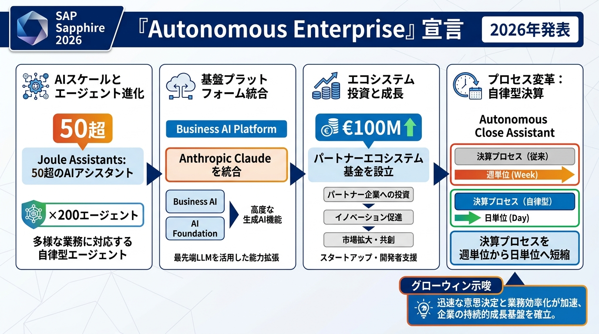
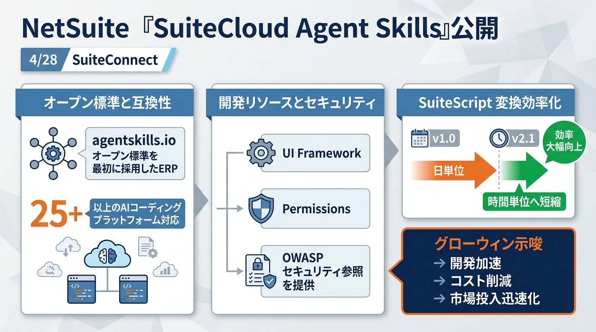
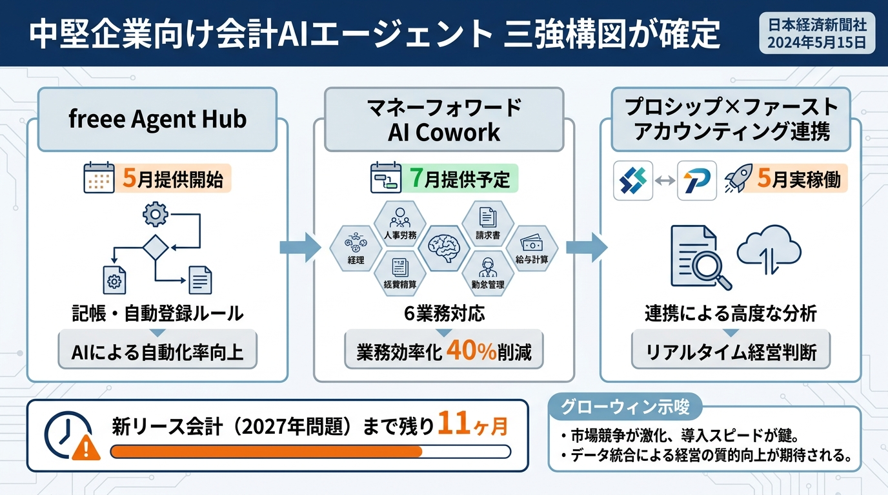
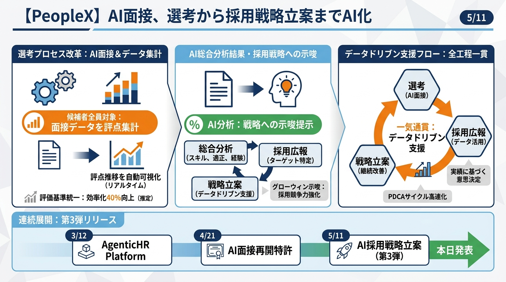
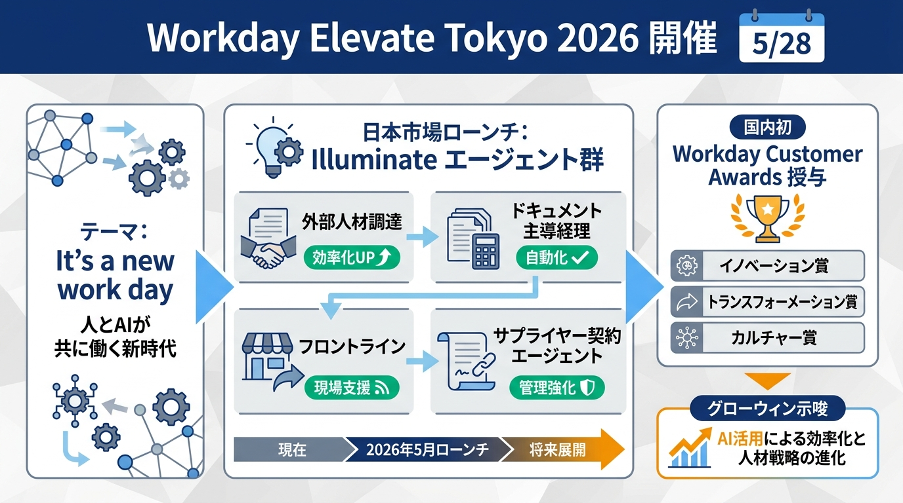
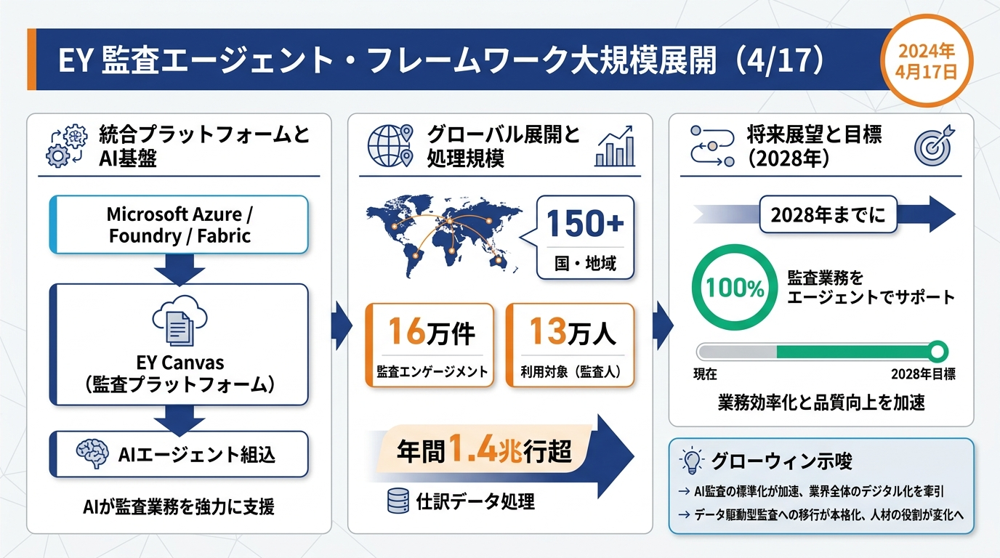
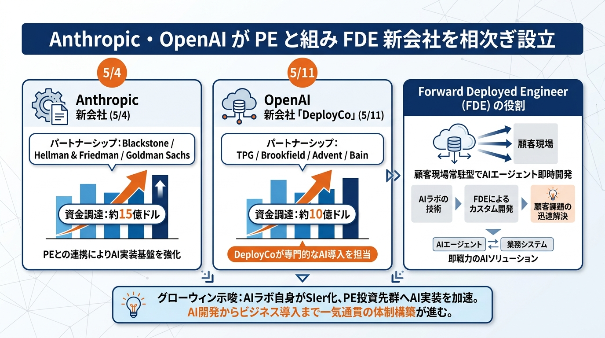
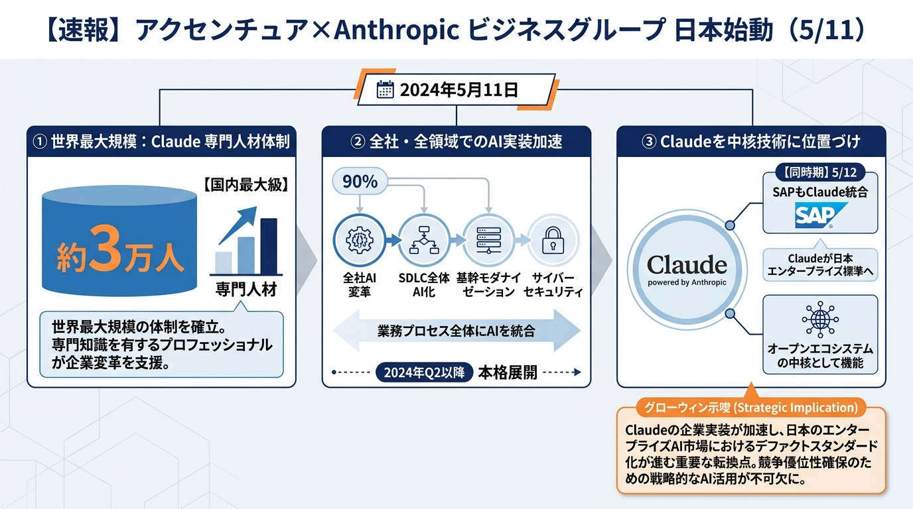
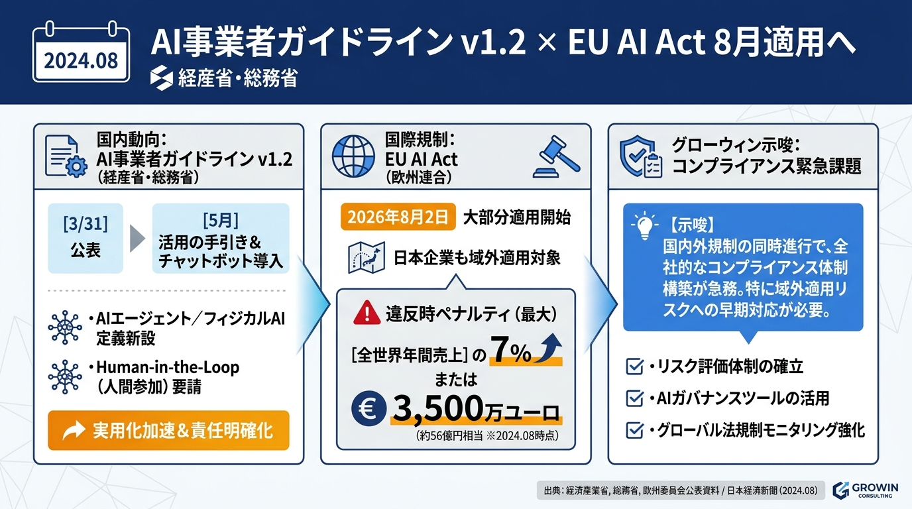

# AI最新ニュース・ダイジェスト

**作成者**: 佐藤圭吾
**作成日時**: 2026年5月27日 13:00
**タグ**: 2026-05-27
**用途**: グローウィン・パートナーズ様向け 定例コンサル 冒頭ニュース共有
**期間**: 2026年4月中旬〜2026年5月中旬
**構成**: バックオフィス領域に直結するニュースを厳選 → グローウィン様への示唆

---

## エグゼクティブサマリー

前月版（4/22）では「AIが"アシスタント"から"エージェント基盤"へと位置づけ直された」と整理しましたが、**この1ヶ月でその"基盤同士が連携・統制・FDE化（現場常駐化）する段階に到達**しました。キーワードは**Autonomous Enterprise**（自律型企業）です。

- **経理・ERP**: SAPが5/12のSapphire 2026で**Autonomous Enterprise構想**を公表、Joule Assistants 50超×200超のエージェント＋**Anthropic Claude統合**＋**€100Mパートナー基金**を発表。NetSuiteは4/28 SuiteConnectで**SuiteCloud Agent Skills**を公開し、AIコーディングエージェント標準（agentskills.io）の最初のERPに。**freee Agent Hub**（5月提供開始）と**マネーフォワード AI Cowork**（7月予定）も同時着弾
- **人事・組織AI**: PeopleX AI面接が5/11に**評点集計・分析示唆機能**を追加し採用戦略立案までAI化。Workdayは5/28 Elevate Tokyoで**Illuminateエージェント群**を国内ローンチ。EYは**監査エージェント・フレームワーク**をMicrosoft Azure統合で発表（年間1.4兆行の仕訳処理）
- **AIガバナンス・FDE化**: 経産省・総務省が**AI事業者ガイドライン第1.2版**を3/31正式公表（v1.2の冊子版は5月配布）。**AnthropicとOpenAIが相次いでPEファンドと組み"FDE新会社"を設立**（5/4・5/11）、客先常駐型AI実装が始動。アクセンチュアは5/11に**Anthropicビジネスグループ**を日本で正式始動（3万人のClaude専門人材）
- **新リース会計（2027年問題）**: **プロシップ×ファーストアカウンティング**の経理AIエージェント×影響額試算ソリューション連携が**5月から実稼働**。残り11ヶ月で「初期段階で足踏みする5割超の企業」を巻き取れる商機
- **グローウィン様への意味**: 4月版で「具体プロダクトと統制要件で価格・工数を語れる」と申し上げましたが、5月は**「自社で導入する側」「クライアントへ売る側」の両面でAIエージェント"基盤の選定"と"統制設計"が論点化**しました。SAP Autonomous Enterpriseは外資系・大手向け、freee Agent Hub＋マネフォAI Coworkは中堅向け──この棲み分けを前提にメニューを組み直すべき1ヶ月です

---

## 1. 経理・ERP領域：SAPが「Autonomous Enterprise」を宣言、AIエージェント基盤戦争が決着フェーズへ

### SAP、Sapphire 2026で「Autonomous Enterprise」とJoule Studio 2.0、Anthropic Claude統合を発表（2026年5月12日）

- 5/11〜13に米Orlando開催のSAP Sapphire 2026にて、CEO Christian Klein氏が**Autonomous Enterprise（自律型企業）**ビジョンを正式宣言
- **50以上のドメイン特化Joule Assistants**（財務・サプライチェーン・調達・人事・CX）を展開、その下に**200以上の専門エージェント**を配備するオーケストレーション構造
- **Autonomous Close Assistant**は決算プロセスを「週単位→日単位」へ短縮。仕訳・照合・エラー解決を自動化
- **Joule Studio 2.0**（マネージド型）を発表。自然言語の指示1本でPRD・技術仕様・エージェント定義まで自動生成。**Cursor IDE / Claude Code連携**、12ヶ月の無償デザインタイム提供
- **Anthropic Claude**をSAP Business AI Platformに統合（MCP標準経由）。財務・人事・調達・SCMでClaudeがJouleエージェントの推論基盤に
- パートナーエコシステム向けに**€100M基金**を設立、RISE with SAP顧客には1年目に3つのJoule Assistant有効化を契約上コミット

**グローウィン示唆**
- 前月版の「3%しか本番利用していないJouleギャップ」が、5/12の**Autonomous Enterprise宣言＋Claude統合＋€100M基金**で「**SAP側がパートナー（コンサル）に旗を振らせる構図**」に変わった。グローウィンが**€100Mパートナー基金活用案件**として手を挙げる絶好機
- **Autonomous Close Assistant**は経理BPO・決算早期化案件と完全に重なる。「**SAP導入済中堅企業のJoule Assistantアクティベーション＋決算早期化（週→日）プロジェクト**」をパッケージ化し、定額＋成果報酬の二段構成で提案可能
- 「Claude × SAP × グローウィン」の**3社建付け**で外資ファームに先んじてリファレンス事例を取りに行く戦略が打てる。特に**PE投資先（中堅製造業）の100日プラン**でAutonomous Closeを差し込む価値が大きい

**出典**: [SAP「Sapphire 2026 Autonomous Enterprise」](https://news.sap.com/2026/05/sap-sapphire-sap-unveils-autonomous-enterprise/) / [SAP「Joule Studio for Enterprise Scale Agentic Development」](https://news.sap.com/2026/05/new-joule-studio-enterprise-scale-agentic-development/) / [SAP × Anthropic「Claude on Business AI Platform」](https://news.sap.com/2026/05/sap-anthropic-to-bring-claude-sap-business-ai-platform/)

### NetSuite、「SuiteCloud Agent Skills」を4/28 SuiteConnectで公開—agentskills.io標準を最初に採用したERPに

- Oracle NetSuiteは2026年4月28日のSuiteConnect San Franciscoで**SuiteCloud Agent Skills**を発表
- **agentskills.io**オープン標準を初めて採用したERPプラットフォームとして、25以上のAIコーディングプラットフォームでNetSuite開発ガイダンスを提供
- 提供スキル：**UI Framework References Skill**（60以上のUIコンポーネント仕様）、**Permissions References Skill**、**OWASP準拠セキュリティ参照**、**SuiteScript v1.0→v2.1変換**（日単位を時間単位へ短縮）
- 自然言語＋AIコーディングエージェントでカスタマイズ開発を加速。**カスタム拡張開発のレビュー・デプロイがリリース→数時間サイクル**へ
- 2026年5月以降、追加スキルがGitHubで順次公開予定

**グローウィン示唆**
- グローウィンのNetSuite導入支援に「**SuiteCloud Agent Skills前提の業界特化アドオン開発**」というメニューを上乗せできる。中堅企業向けの**業界別経理AIエージェント**（小売・卸・SaaS等）を、従来工数の1/3で量産可能
- 既存クライアントへの能動的な声掛けが効く：「**2026.1のAsk Oracle/Text Enhance**＋**Agent Skillsによる業界別アドオン**＋**Joule/Workdayとのエージェント間連携**」を一体で提案
- 外部AIコーディングエージェント（Claude Code、Cursor、Codex等）が直接NetSuiteカスタマイズに入る時代＝**従来のSI/SuiteCloud開発外注の単価が下がる**。グローウィンは**「業務設計＋AIエージェント運用設計」**という上流に陣取り、開発単価競争を避ける

**出典**: [NetSuite公式「SuiteCloud Agent Skills」](https://www.netsuite.com/portal/company/newsroom/netsuite-brings-ai-powered-speed-and-precision-to-suitecloud-development.shtml) / [Oracle CIO「AI coding skills for SuiteCloud」](https://www.cio.com/article/4164878/oracle-netsuite-announces-ai-coding-skills-for-suitecloud-developers-2.html)

### freee Agent Hub（5月提供開始）×マネーフォワード AI Cowork（7月提供開始）—中堅企業向け会計AIエージェントが二大勢力に

- **freee**：2026年4月16日、認定アドバイザー（5,500超）向けに**「freee Agent Hub」を5月提供開始**と発表。チャットで指示するだけで**資料回収→記帳→確認・修正→決算申告**を段階的に自動化。記帳エージェント・自動登録ルール管理エージェントを初期搭載。デスクトップアプリ＋キャンバスUI＋ジョブスケジューラを内蔵
- **マネーフォワード**：4/7発表、**「マネーフォワード AI Cowork」を2026年7月提供開始予定**。バックオフィス6業務（経理・人事労務・請求書・経費・契約・販売）を**"同僚のように"自律遂行**するAIサービス
- マネーフォワードは5/25〜26にオンラインカンファレンス**「経理とAIで描く、未来への第一歩。-CONNECT with AI-」**を開催。ソニーグループのグローバル経理センター統括部長らが登壇、内部統制・不正対策×AIをテーマに
- **プロシップ×ファーストアカウンティング**：新リース会計基準対応の経理AIエージェントと影響額試算ソリューションの**連携を5月から実稼働**（5/12発表）。新リース会計の「契約識別→影響額試算」が一気通貫自動化

**グローウィン示唆**
- 中堅企業向けの**会計AIエージェントは「freee Agent Hub」「マネフォAI Cowork」「ファーストアカウンティング Robota」の三強構図**に整理できた。グローウィン側は**三製品それぞれのリファレンス導入支援メニュー**を持つことで、クライアントのSaaS選定状況に左右されずに商談を取れる
- 特に**新リース会計2027年問題**は残り11ヶ月。「5割超の企業が初期段階で足踏み」という現状に対し、**プロシップ×ファーストアカウンティング連携の導入＋運用設計＋開示資料準備**を**期間限定パッケージ**として打ち出すと、年内の駆け込み需要を取れる
- **マネフォCONNECT with AI（5/25-26）**は「内部統制×AI」「経理人材育成×AI」が中心テーマ。グローウィンの**経理人材育成・内部統制コンサル**と完全に同じ問題意識。グローウィン版「**経理AI実装×統制設計ハンドブック**」をホワイトペーパー化して先出しする好機

**出典**: [freee「freee Agent Hub提供開始」](https://corp.freee.co.jp/news/20260416freee_freeeAgentHub&API.html) / [マネーフォワード「AI Cowork 7月提供開始」](https://corp.moneyforward.com/news/release/service/20260407-mf-press-1/) / [マネーフォワード「CONNECT with AI開催」](https://corp.moneyforward.com/news/release/service/20260416-mf-press-1/) / [プロシップ×ファーストアカウンティング「実務水準のAIソリューション」](https://www.fastaccounting.jp/news/20260512/16037/)

---

## 2. 人事・組織領域：AIが「採用→評価→監査」の全工程を貫通する基盤に

### PeopleX AI面接、選考から採用戦略立案までAI化—5/11に「面接データ分析・示唆機能」追加

- PeopleXは2026年5月11日、対話型AI面接サービス**「PeopleX AI面接」**に新機能を追加と発表
- 候補者全員の面接データをもとに**評点集計結果・推移を自動可視化**、AIが**総合分析結果・採用戦略への示唆**を提示
- 「選考→採用広報→戦略立案」までAIがデータドリブンに意思決定を支援する構造へ進化
- 前月版で扱った3/12の**AgenticHR Platform提供開始**、4/21の**AI面接再開特許**と地続き。**運用データ→分析→戦略提案**のループが完成

**グローウィン示唆**
- 採用コンサル領域で「AI面接導入→評点データを蓄積→**採用戦略の年次レビューを AIが下書き**→グローウィンがレビュー・修正」という**運用設計込みの定額型サービス**を組める
- Talent Growth Hub部の尾田さん領域に直撃。**「PeopleX AI面接×グローウィン採用戦略レビュー」を組み合わせた継続型契約**は、従来のスポット採用支援と比較してLTVが3〜5倍に伸びる
- 中堅企業のCHRO向けに「**選考プロセスのAI化と公平性監査**」をセットで提案できる。AI事業者ガイドラインv1.2の人間介在要件とも整合

**出典**: [PeopleX「AI面接 分析示唆機能」（日経）](https://www.nikkei.com/article/DGXZRSP706780_R10C26A5000000/) / [PeopleX AI Momentum 2026](https://corp.peoplex.jp/ai-momentum2026)

### Workday Elevate Tokyo（5/28開催）、「人とAIが共に働く新時代」テーマでIlluminateエージェント国内ローンチへ

- 2026年5月28日（木）、ANAインターコンチネンタルホテル東京にて**Workday Elevate Tokyo 2026**を開催
- テーマは**"It's a new work day"**＝人とAIが共に働く新時代。人事・財務・ITの3観点でAIエージェント統合の最新事例を提示
- 国内初の**Workday Customer Awards**を授与。NTTデータ・デロイト・三井情報・ペイロール等のパートナーが出展
- Illuminateエージェント群（**外部人材調達エージェント、ドキュメント主導経理エージェント、フロントラインエージェント、サプライヤー契約エージェント**等）が**2026年初頭の本格提供**を受けて日本市場でのローンチを宣言

**グローウィン示唆**
- 翌日5/28＝**会議翌日にイベントがある**ため、本日の冒頭で「**Workday Elevateで最新動向を取りに行きます。御社の人事DX計画にも反映できる情報を持ち帰ります**」と能動的にコミットすれば、定例MTGの価値が一段上がる
- **Workday導入済の準大手・PE投資先**を対象に、**「Illuminate前提の人事制度再設計＋財務クローズエージェント連携設計」**という横断メニューを作れる
- パートナー展示にNTTデータ・デロイトが入っている。グローウィンも**Workday認定パートナー化＋エージェント運用設計の独立メニュー**を狙うべき（中堅企業向けに価格を抑えた版）

**出典**: [Workday Elevate Tokyo 2026](https://www.workday.com/ja-jp/elevate-japan.html) / [Workday日本「Illuminateエージェント発表」](https://ja-jp.newsroom.workday.com/2025-05-29-workday-unveils-next-generation-of-illuminate-agents-to-transform-hr-and-finance-operations)

### EY、監査エージェント・フレームワークをMicrosoft Azure統合で発表—2028年までに監査業務の100%をエージェントでサポート

- EYは2026年4月17日、監査・保証領域に**エージェント型AI（マルチエージェント・フレームワーク）**をグローバル大規模展開と発表
- Microsoft Azure / Foundry / Fabricと統合し、**EY Canvas**（監査プラットフォーム）に直接組込み
- **150以上の国・地域、16万件の監査エンゲージメント、13万人のプロフェッショナル**が利用対象
- **年間1.4兆行を超える仕訳データ処理**、継続更新される会計・監査ガイダンスへの前例なきアクセス
- 2028年までに**監査業務の100%をエージェントでサポート**するロードマップを提示。EY新日本は既に3,805社にDocument Intelligence Platformを展開済
- KPMGも監査プラットフォーム「KPMG Clara」にAIエージェントを統合、世界9.5万人の監査プロに導入

**グローウィン示唆**
- 監査法人側（被監査側ではなく）がAIエージェント化すると、**被監査側のグローウィンのクライアントに「AI監査対応の準備」が要求される**。例：仕訳データの粒度・タイムスタンプ・統制ログの整備
- 「**AI監査前提のJ-SOX・統制再設計**」を新メニュー化できる。具体的には：仕訳粒度の統一、エージェント間のジャーナルエントリー監査証跡整備、AI事業者ガイドラインv1.2準拠の人間介在ログ
- 前月版で言及した「**被監査側の運用設計役**」というポジションが、5月のEY大規模展開でますます強固になる。**「グローウィンは監査法人がAIで突っ込んでくる前に被監査側の運用とデータ整備を済ませる役割」**として営業トークを明確化

**出典**: [EY Japan「エージェント型AI大規模導入」](https://www.ey.com/ja_jp/newsroom/2026/04/ey-japan-news-release-2026-04-17) / [Business Insider「EY監査エージェント・フレームワーク」](https://www.businessinsider.jp/article/2604-ey-launches-ai-agent-framework-for-assurance-audit-big-four/)

---

## 3. 導入の勝ち筋：AIエージェントの「FDE化」「PE×AI合弁」「日本でのClaude大型陣営」

### Anthropic・OpenAIが相次いでPEファンドと組み「FDE新会社」を設立（2026年5月4日／5月11日）

- **Anthropic**は2026年5月4日、**Blackstone・Hellman & Friedman・Goldman Sachs**らPE/IB連合とFDE新会社を設立（追加投資にGeneral Atlantic / Leonard Green / Apollo / Singapore GIC / Sequoia）。総額**約15億ドル**
- **OpenAI**は5月11日、**OpenAI Deployment Company（DeployCo）**を**TPG / Brookfield / Advent / Bain Capital**との合弁として設立、**10億ドル規模ファンド**
- 両社とも**自社AIに精通したエンジニアを顧客企業の現場に常駐**させ、業務課題を聞き取り→AIエージェントを即時開発する**Forward Deployed Engineer（FDE）型ビジネスモデル**
- 4月版で扱ったアクセンチュアのFDE組織と並び、**AIラボ自身がSIerになる**構造変化が一気に加速
- 「APIサブスクの収益限界」を突破するため、**PEの投資先群（中堅〜大企業）にAI実装を半ば強制的に進める**狙い

**グローウィン示唆**
- **国内中堅企業のPE投資先**は、近い将来「**ファンド経由でDeployCoやAnthropic FDEのエンジニアが入ってくる**」可能性が現実化。グローウィンはこの**前哨戦**で「**経営管理・人事・財務のAI化グランドデザイン**」を作って待ち構えるべき
- 外資FDEは**業務側の理解が薄い**ため、「**業務設計はグローウィン、AI実装はFDE**」という分業を売り込めば、衝突せず協業可能。むしろグローウィンの存在価値が上がる
- バトンズ上場（4/21）に続く**「M&A×AI」資本市場の流れ**と組み合わせ、**「PE投資先のValue Up支援メニュー（AIエージェント前提）」**を独立商品化する好機。EY「PEファンドにとってのコスト削減と価値創造4分野」とも整合

**出典**: [日経xTECH「AnthropicやOpenAIがFDE新会社、PEファンドと組む怖い理由」](https://xtech.nikkei.com/atcl/nxt/column/18/00692/051400188/) / [プレジデント「OpenAI/Anthropic×PE合弁」](https://president.jp/articles/-/113287)

### アクセンチュア×Anthropic、「Anthropic ビジネスグループ」日本で正式始動（2026年5月11日）—3万人のClaude専門人材

- アクセンチュアは2026年5月11日、米Anthropicとのグローバル戦略的パートナーシップのもと**「アクセンチュア Anthropic ビジネスグループ」**の日本での活動を5/1付で本格始動と発表
- 全社AI変革の設計と実行、Claude活用の**SDLC（ソフトウェア開発ライフサイクル）全体AI化**、基幹システムのモダナイゼーション、サイバーセキュリティ変革の4領域で支援
- 2025年12月発表のグローバル協業を受け、**世界最大規模となる約3万人のClaude専門人材体制**を構築済
- 日本市場でも**Claude powered by Anthropic**を中核技術として位置づけ、要件定義→設計→開発→テスト→運用までを通貫AI化
- 同時期にSAPがClaude統合を発表しており（5/12）、**Claudeが日本のエンタープライズAIの「標準的な裏側」**になりつつある

**グローウィン示唆**
- アクセンチュアが**大手・超大手**を3万人体制で押さえに行く一方、グローウィンは**中堅〜準大手・PE投資先**で**「Claude × SAP × 中堅企業」の専門ポジション**を取れる。アクセンチュアの1/3の価格帯で同等の業務理解を提供する戦略は依然有効
- 自社でも**Claude for Microsoft 365（5/7正式提供）**、**Claude on SAP**、**Claude Code**を組み合わせた**「グローウィン版AI伴走スタック」**を内製化し、提案資産化すべき
- 「**SAP×Anthropic公式連携が始動した中堅企業向け実装パートナー**」というポジションをグローウィンが先に取れば、SAPジャパン・Anthropic Japanの**紹介リファラル経路**が開ける

**出典**: [アクセンチュア「Anthropicビジネスグループ日本始動」](https://newsroom.accenture.jp/jp/news/2026/accenture-and-anthropic-to-drive-enterprise-reinvention-with-ai-in-japan) / [ITmedia「Claude活用4領域」](https://www.itmedia.co.jp/enterprise/articles/2605/13/news046.html)

### AI事業者ガイドライン第1.2版（3/31公表）—活用の手引き＆チャットボット導入、企業対応の具体化フェーズへ

- 経産省・総務省は2026年3月31日に**AI事業者ガイドライン第1.2版**を正式公表（4〜5月にかけて配布・周知が進む）
- 改定の主眼は**AIエージェント／フィジカルAIの定義新設**と、リスク評価後の**人間判断介在（Human-in-the-Loop）**の組み込み要請
- 経済産業省が**「活用の手引き」**、総務省が**チャットボット（ルールベースAI）**を導入し、企業が実務に落とし込みやすい環境を整備
- **EU AI Act**は2026年8月2日に大部分が適用開始予定。EU域内にAIシステムを上市する日本企業も**域外適用**で対象に。違反時は最大で**全世界年間売上の7%または3,500万ユーロ**

**グローウィン示唆**
- 前月版で提案した「**AIエージェント統制レビュー**」を、活用の手引き公開を契機に**「v1.2準拠ギャップ診断＋是正計画策定」の正式メニュー**へ昇格できる。診断ツール（チェックリスト）を**グローウィン版で標準化**してオリジナル資産化すべき
- **EU AI Act 2026年8月適用開始**まで残り3ヶ月。EU域内に製品・サービスを出す中堅製造業・ヘルスケア企業向けに、**「EU AI Act対応支援パッケージ」**を急ピッチで商品化（罰金最大「全世界売上の7%」というインパクトは経営層に響く）
- 「**AI事業者ガイドラインv1.2 × EU AI Act × J-SOX**」の三層統制を一貫設計できるのは、業務設計・人事制度・内部統制すべてを持つグローウィンの独自ポジション。**監査法人や法律事務所では作れない設計**

**出典**: [AI事業者ガイドライン第1.2版（経産省・総務省）](https://www.meti.go.jp/shingikai/mono_info_service/ai_shakai_jisso/pdf/20260331_1.pdf) / [日経xTECH「自律実行に人間判断介在を」](https://xtech.nikkei.com/atcl/nxt/column/18/00001/11580/) / [PwC「EU AI規制法解説」](https://www.pwc.com/jp/ja/knowledge/column/awareness-cyber-security/generative-ai-regulation10.html)

---

## グローウィン様にとっての論点整理

### 1. クライアント向けの新しい提案余地
- **経理財務**: SAP Autonomous Close Assistantによる決算「週→日」プロジェクト／NetSuite SuiteCloud Agent Skillsを活用した業界特化アドオン量産／freee Agent Hub・マネフォAI Cowork導入支援＋運用設計／プロシップ×ファーストアカウンティング連携を使った**新リース会計2027年問題駆け込みパッケージ**
- **人事**: PeopleX AI面接×採用戦略レビューの定額型継続契約／Workday Illuminate前提の人事制度再設計＋財務クローズエージェント連携／中堅企業CHRO向けの**選考プロセスAI化＋公平性監査**
- **統制・規制**: AI事業者ガイドラインv1.2準拠ギャップ診断＋是正計画／EU AI Act対応支援パッケージ（2026年8月適用に向けて3ヶ月集中）／**AI監査前提のJ-SOX再設計**（仕訳粒度・統制ログ・人間介在ログ）
- **M&A／PE**: PE投資先のValue Up支援メニュー（AIエージェント前提のグランドデザイン）／FDE新会社（DeployCo・Anthropic FDE）入りを想定した**業務設計の事前構築**

### 2. 自社でも先に使うべき領域
- **Claude for Microsoft 365（5/7正式提供）**＋**Claude on SAP**＋**Claude Code**を組み合わせ、**グローウィン版AI伴走スタック**を内製化→提案資産化
- **マネフォCONNECT with AI（5/25-26）**の登壇内容（内部統制×AI、経理人材育成×AI）を社内勉強会で即取り込み、**経理AI実装×統制設計ハンドブック**として外販化
- **freee Agent Hub**を社内BPOで先行運用し、認定アドバイザー側のリファレンス事例を確保
- **AI事業者ガイドラインv1.2準拠の社内AIガバナンス体制**を、5月中に「活用の手引き」を使って完成させ、それ自体を**診断ツール**として商品化

### 3. 今後の勝ち筋
- **「Claude × SAP × 中堅企業」の専門ポジション**：SAP×Anthropic公式連携の追い風で、中堅企業向け実装パートナーを先取りする
- **「外資FDEとの分業」**：DeployCo・Anthropic FDEが中堅企業に入る前に、**業務設計＝グローウィン／AI実装＝FDE**の役割分担を設計しておく
- **「AI監査時代の被監査側パートナー」**：EYが13万人体制・年間1.4兆行処理を始める中、グローウィンは「**監査法人が突っ込む前に被監査側の運用とデータを整える**」ポジションを独占
- **「2027年問題駆け込み」**：新リース会計強制適用まで11ヶ月。プロシップ×ファーストアカウンティング連携と組み、**期間限定パッケージ**で年内の駆け込み需要を取り切る

---

## 今日の会議で特に使いたいニュース TOP5

| 順位 | ニュース | 理由 |
|------|---------|------|
| 1 | **SAP Sapphire 2026「Autonomous Enterprise」＋Claude統合（5/12）** | 半月前の最大ニュース。前月版「Joule 3%本番利用」のギャップが**€100Mパートナー基金＋Claude統合**で一気に解消フェーズへ。グローウィンが「**Autonomous Close Assistant導入支援**」を新メニュー化する宣言を冒頭で打てる |
| 2 | **AnthropicとOpenAIのFDE新会社設立（5/4・5/11）** | バトンズ上場（4/21）に続く資本市場の動き。**PE投資先にFDEが入る前にグローウィンが業務設計で待ち構える**ストーリーは経営層に強く刺さる |
| 3 | **freee Agent Hub（5月提供開始）＋マネフォAI Cowork（7月予定）＋プロシップ×FA連携（5月）** | 中堅企業向け会計AIエージェントの三強構図が確定。**新リース会計2027年駆け込みパッケージ**として今月中に商品化宣言できる |
| 4 | **Workday Elevate Tokyo（明日5/28）＋EYの監査AIエージェント大規模導入（4/17）** | 翌日のイベントで最新情報を持ち帰る能動的姿勢を示せる。EYの13万人体制は**「AI監査時代の被監査側統制再設計」**を語る最強の根拠 |
| 5 | **アクセンチュア×Anthropicビジネスグループ日本始動（5/11）＋AI事業者ガイドラインv1.2活用の手引き** | 外資の動きを横目に、**「中堅企業向けは1/3価格×同等業務理解」**のグローウィンポジションを改めて宣言。ガイドラインv1.2は**統制商品の正式メニュー化**のトリガー |

---

*調査日: 2026-05-27 / 情報源: SAP News Center、Oracle NetSuite公式、freee公式、マネーフォワード公式、ファーストアカウンティング公式、プロシップ公式、PeopleX公式、Workday日本、EY Japan、Anthropic / OpenAI報道、日本経済新聞、日経xTECH、アクセンチュア・ニュースルーム、経産省・総務省、PwC Japan、ITmedia エンタープライズ*
